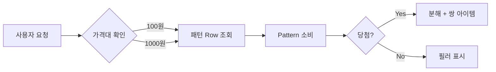

# SIGIL Pipeline Rules (Compiled 2026-03-11)

> Auto-generated by manage-rules.sh build --scope sigil
> Progressive Disclosure: CRITICAL/HIGH=전문, MEDIUM/LOW=요약+참조
> Source: 09-tools/rules-source/sigil/

---


# SIGIL 거버넌스

## 병렬 실행 도구 매핑

| 패턴 | 도구 | 적용 시점 |
|------|:----:|----------|
| **Fan-out/Fan-in** | **Subagent** | S1 리서치 (독립 영역 병렬), 멀티 프로젝트 병렬 |
| **Competing Hypotheses** | **Agent Teams** | S3 기획서 에이전트 회의 |
| **Pipeline** | 순차 Subagent | S1→S2→S3→S4 순차 의존 |

## 모델 계층화

```
pipeline-orchestrator (Lead)    → Opus 4.6   (판단, 종합, 회의 심판)
기획서 작성 (gdd/prd)           → Sonnet 4.6 (문서 작성, 분석)
기획 패키지 작성 (technical-writer) → Sonnet 4.6 (S4 산출물 작성)
리서치/검색 Teammates            → Haiku 4.5  (검색, 팩트체크, 트렌드 수집)
```

## PM 도구 연동

### 2-Tier Fallback

| Tier | 조건 | 도구 |
|:----:|------|------|
| Tier 1 | Notion MCP 연결 가능 | Notion 자동 등록 |
| Tier 2 | Notion 연결 불가 | 내부 Markdown Todo 문서 |

- pipeline-orchestrator가 파이프라인 시작 시 Tier 자동 선택
- 각 게이트([STOP] 또는 [AUTO-PASS]) 통과 시 다음 Stage 태스크를 자동 등록
- 상세 구조: `{folderMap.templates}/notion-task-template.md` 참조

## Trine 연동

### S4 완료 시 자동 액션

1. 기획 패키지 산출물 존재 확인
2. **Handoff 요약 문서 자동 생성**: `{folderMap.handoff}/{target-project}/YYYY-MM-DD-sigil-handoff.md`
3. Trine 진입 안내 메시지 Human에게 제공
4. **Human이 개발 프로젝트로 이동하면 Trine 자동 발동** (Implicit Entry)

### SIGIL 산출물 → Trine 매핑

| SIGIL 산출물 | Trine 활용 시점 |
|-------------|----------------|
| S1 리서치 | Phase 1 컨텍스트 참고 |
| S3 기획서 (PRD/GDD) | Phase 1.5 요구사항 분석, Phase 2 Spec 작성 입력 |
| S4 기획 패키지 | Phase 1 세션 이해, Phase 2 Spec 작성 입력 |
| S4 Trine 세션 로드맵 | Trine 세션별 범위/산출물 가이드 |

## 게이트 유형

| 유형 | 동작 | 사용 |
|------|------|------|
| **[STOP]** | AI 검증 → 파이프라인 중단 → Human 승인 대기 | 전략적 판단 필요 (S2, S3) |
| **[AUTO-PASS]** | AI 검증 → 알림 출력 → 자동 진행 | 기계적 검증 충분 (S1, S4) |

[AUTO-PASS] 알림 형식:
- `✅ {Stage} Gate AUTO-PASS: {DoD 요약}`
- `→ {다음 Stage}로 자동 진행합니다. 이상 있으면 말씀해주세요.`
- Human은 언제든 "잠깐, {Stage} 다시 봐줘"로 소급 개입 가능
- 자동 검증 FAIL 시 → [STOP]으로 에스컬레이션

## 게이트 로그 메커니즘

각 게이트([STOP] 또는 [AUTO-PASS]) 통과 시 프로젝트 폴더에 `gate-log.md`를 자동 생성/업데이트한다.

```markdown
## Gate Log — {프로젝트명}

| Stage | 결과 | 일자 | 세션 | 조건 | 비고 |
|:-----:|:----:|------|:----:|------|------|
| S1 | ✅ AUTO | YYYY-MM-DD | 1 | DoD 자동 검증 통과 | 신뢰도 High 72% |
| S2 | ✅ PASS | YYYY-MM-DD | 1 | Go/No-Go 85점 | |
| S3 | — | — | — | — | |
| S4 | — | — | — | — | |
```

## Stage별 DoD (Definition of Done)

각 게이트 통과 전 DoD 체크리스트를 검증한다.
상세 체크리스트: `{folderMap.templates}/dod-checklist.md`

## Stage별 방법론 참조

> 상세 방법론 설명은 `docs/planning/done/2026-02-27-sigil-pipeline-architecture.md` 참조

| Stage | 필수 방법론 | 선택 방법론 |
|:-----:|-----------|-----------|
| S1 | AI-augmented Research, JTBD, Competitive Intelligence, Evidence-Based Mgmt | SOAR, PESTLE |
| S2 | Pretotyping, Mom Test, Lean Validation, TAM/SAM/SOM, OKR | OST, PR/FAQ |
| S3 | Shape Up Pitch, User Story Mapping, Modern PRD | Outcome-based Roadmap, Event Storming |
| S4 | Now/Next/Later, RICE/ICE, C4 Model, ADR | WSJF |
| 거버넌스 | Stage-Gate, Go/No-Go, DACI, Double Diamond | Pre-mortem |
| 관리 | Personal Kanban, Decision Log | — |

## 병렬 멀티 프로젝트

각 프로젝트가 독립 Subagent로 병렬 실행 가능:

```
Project A (게임 S1~S4) ────→ Trine
Project B (앱 S1~S4) ──────→ Trine
Project C (웹 S1~S4) ──────→ Trine
```

## Playground 활용 가이드 (선택적)

Playground Plugin이 설치된 환경에서, 기획 중 시각적 탐색이 필요하면 아래 매핑에 따라 Playground 템플릿을 활용한다.

| Stage | 템플릿 | 활용 시점 |
|:-----:|:------:|----------|
| S1 | concept-map | 시장 구조, 경쟁사 관계, 기술 트렌드 맵핑 |
| S1 | data-explorer | TAM/SAM/SOM 수치, 시장 데이터 시각 탐색 |
| S2 | concept-map | 컨셉 관계도, 핵심 가치 제안 맵핑 |
| S3/S4 | design-playground | UI 레이아웃, 컬러, 타이포그래피 의사결정 |
| S4 | code-map | 아키텍처 시각화, 모듈 관계도 |
| 모든 Gate | document-critique | [STOP] Gate에서 구조화된 문서 리뷰 |

- Playground는 **권장 도구**이며 필수가 아니다
- 생성된 HTML 파일은 일회성 탐색 도구로 사용. Git에 커밋하지 않는다
- `playground:playground` 스킬 호출로 생성한다

## S4 시작 시 보고

S4 Wave 1 시작 전:
1. 3종 산출물 작성 순서를 Human에게 간략 보고 (승인 대기 아님)
2. 관리자 산출물 포함 여부 확인
3. 즉시 Wave 1 진행

> S3는 에이전트 회의(Competing Hypotheses)가 구조 검증 역할을 대체하므로 별도 Intra-Gate를 수행하지 않는다.

## Do

- 시각적 탐색이 필요한 기획 단계에서 Playground 활용을 검토한다
- Stage별 DoD 체크리스트를 게이트 판단 전 확인한다
- 게이트 통과 시 gate-log.md를 자동 업데이트한다
- PM 도구 Tier를 파이프라인 시작 시 자동 판단하고, 게이트 통과 시 태스크를 등록한다
- 모델 계층화(Opus/Sonnet/Haiku)를 작업 성격에 맞게 적용한다

## Don't

- 게이트 통과 시 gate-log.md 업데이트를 생략하지 않는다
- DoD 체크리스트 검증 없이 게이트를 통과하지 않는다

## AI 행동 규칙

1. Stage별 DoD 체크리스트를 게이트 판단 전 확인한다
2. 게이트 통과 시 gate-log.md를 자동 업데이트한다
3. PM 도구 Tier를 파이프라인 시작 시 자동 판단하고, 게이트 통과 시 태스크를 등록한다
4. S4 완료 후 Trine Handoff 문서를 자동 생성하고 진입을 안내한다

---

## SIGIL 산출물 경로

> 모든 경로는 `sigil-workspace.json`의 `folderMap`에서 해석한다.

> 상세: `09-tools/rules-source/sigil/sigil-outputs.md` 참조

---

## S1 리서치

- research-coordinator → 아래 실존 리소스를 Fan-out 병렬 조율:

> 상세: `09-tools/rules-source/sigil/sigil-s1-research.md` 참조

---


# S2 컨셉 확정

## S2. Concept (컨셉 확정)

- `/lean-canvas` + 제품/게임 컨셉
- **필수 방법론**: Pretotyping + Mom Test + Lean Validation + TAM/SAM/SOM + OKR
- **선택 방법론**: OST (Opportunity Solution Tree), PR/FAQ
- **플러그인 보강** (선택적):
  - `product-management:roadmap-management` — 로드맵 우선순위 결정 시 RICE/ICE 자동 스코어링 보조
- **산출물**: `{folderMap.product}/{project}/YYYY-MM-DD-s2-concept.md`
- **게이트**: **[STOP]** 비전/타겟/차별점 승인

## S2 Gate: Go/No-Go 스코어링

S2 [STOP] 게이트에서 프로젝트 진행 여부를 정량 평가한다.

| 영역 | 가중치 | 평가 기준 |
|------|:-----:|---------|
| 시장 기회 | 30% | TAM/SAM/SOM, 성장률, 타이밍 |
| 기술 실현성 | 25% | 기술 스택 검증, 리소스 가용성 |
| 비즈니스 모델 | 25% | 수익화 경로, 유닛 이코노믹스 |
| 위험 관리 | 20% | 규제, 경쟁, 기술 리스크 |

- **80점+ = Go** → S3 진행
- **60-79점 = 조건부** → 보완 후 재평가
- **60점 미만 = No-Go** → 피벗 또는 중단

### Kill Criteria (하나라도 해당 시 즉시 No-Go)

- TAM < $1M (시장 규모 부족)
- 경쟁사 70%+ 시장 점유 (진입 장벽)
- 핵심 기술 불가 (현재 기술로 구현 불가)
- 규제 장벽 (법적으로 출시 불가)

## Do

- 필수 방법론(Pretotyping, Mom Test, Lean Validation, TAM/SAM/SOM, OKR)을 적용한다
- Go/No-Go 스코어링은 Kill Criteria 검토 후 실행한다
- 산출물은 `{folderMap.product}/{project}/`에 저장한다

## Don't

- Kill Criteria에 해당하는 프로젝트를 Go로 판정하지 않는다
- Go/No-Go 스코어링 없이 S3로 진행하지 않는다
- 비전/타겟/차별점 승인 없이 [STOP] 게이트를 통과하지 않는다

## AI 행동 규칙

1. S2 Go/No-Go 스코어링은 Kill Criteria 검토 후 실행한다
2. 각 Stage 산출물은 해당 폴더의 `projects/{project}/` 하위에 저장한다
3. 프로젝트 폴더 내 파일명에서 프로젝트명을 제거한다 (폴더가 이미 프로젝트를 나타냄)
4. S2 Gate에서 [Human] 항목(Mom Test, Pretotype) 미실행 시 gate-log 비고에 "계획서로 갈음" 명시 기록한다

---


# S3 기획서

## S3. Design Document (기획서)

| 유형 | 에이전트/커맨드 | 산출물 |
|------|---------------|--------|
| 앱/웹 | `/prd` 커맨드 | PRD (.md + **.pptx 필수**) |
| 게임 | gdd-writer 에이전트 | GDD (.md + **.pptx 필수**) |

- **에이전트 회의**: Competing Hypotheses — 기획 에이전트 2~3명 독립 초안 → 최적안 선택/병합
- **필수 방법론** (유형별):

| 유형 | 필수 방법론 |
|------|-----------|
| 앱/웹 | Shape Up Pitch + User Story Mapping + Modern PRD |
| 게임 | GDD 10섹션 완성 + Core Loop 검증 + 밸런싱 수치 테이블 + 에이전트 회의 |

- **선택 방법론**: Outcome-based Roadmap, Event Storming
- **플러그인 보강** (선택적):
  - `product-management:stakeholder-comms` — PRD 승인 후 이해관계자 업데이트 생성
  - `marketing:competitive-analysis` — 배틀카드 생성 기능 보조
- **PPT 변환 필수**: S3 기획서 .md 완성 후 `/pptx` 스킬로 .pptx 생성 필수
- **게이트**: **[STOP]** 기획서 승인 (PPT 포함)

## 기획서 구조 원칙

**피라미드 원칙 (McKinsey)**: 기획서(.md)와 PPT 모두 **결론 먼저, 근거 나중** 구조를 따른다. 각 섹션의 첫 문장이 핵심 주장이고, 이하 내용이 근거를 뒷받침한다. 읽는 사람이 첫 페이지만 읽어도 전체 방향을 파악할 수 있어야 한다.

**PPT 서사 구조 (Duarte)**: PPT 슬라이드 흐름은 "현재 상태(문제) → 미래 상태(해결)" 긴장-해소 반복 구조로 설계한다.
- 슬라이드 1-2: 현재 문제/기회 (What Is)
- 슬라이드 3-N: 해결 방안 + 근거 (What Could Be)
- 마지막: 실행 계획/결론 (Call to Action)

---

## 시각 자료 필수 포함 규칙

기획서(.md)와 PPT 모두에 시각 자료를 풍부하게 포함한다. 텍스트만으로 구성된 기획서는 이해도와 전달력이 50% 이하로 떨어진다.

### 필수 시각 자료 (최소 기준)

| 유형 | 필수 항목 | 도구 |
|------|----------|------|
| **플로우 다이어그램** | 핵심 사용자 플로우, 데이터 흐름, 상태 전이 | Mermaid (.md), PptxGenJS 도형 (.pptx) |
| **비교 차트/그래프** | 경쟁사 비교, 시장 데이터, 수치 분석 | PptxGenJS Charts (BAR, PIE, LINE) |
| **구조 다이어그램** | 시스템 구조, 모듈 관계, 기능 계층 | Mermaid (.md), 도형 조합 (.pptx) |
| **테이블/매트릭스** | 기능 비교표, 우선순위 매트릭스, 스코어링 | Markdown 테이블 (.md), PptxGenJS Table (.pptx) |
| **일러스트/이미지** | 컨셉 비주얼, 테마 이미지 | NanoBanana MCP (AI 생성) |
| **UI 목업/화면 설계** | 핵심 화면 목업, 레이아웃 탐색, UI 변형 비교 | Stitch MCP (AI UI 생성) |

### 슬라이드별 시각 가이드 (PPT)

| 슬라이드 유형 | 권장 시각 요소 |
|-------------|--------------|
| 타이틀 | NanoBanana 배경 이미지 + 컨셉 일러스트 |
| 시스템 개요 | 비교 테이블 + 핵심 차별점 다이어그램 |
| 플로우/프로세스 | 단계별 카드 + 화살표 플로우 |
| 데이터/수치 | BAR/PIE 차트 + 대형 스탯 콜아웃 |
| 구조/아키텍처 | 박스-화살표 다이어그램 + 레이어 도형 |
| 경제/비즈니스 | 데이터 테이블 + 그래프 조합 |
| 의사결정 요약 | 그리드 카드 레이아웃 |

### UI 목업 생성 with Stitch

앱/웹 프로젝트에서 핵심 화면의 UI 목업을 Stitch MCP로 생성한다.

**활용 시점:**
- S3 기획서에 핵심 화면 목업을 포함할 때
- 에이전트 회의에서 UI 안을 비교할 때 (generate_variants로 변형 생성)
- PPT에 삽입할 화면 레이아웃 참조가 필요할 때

**워크플로:**
1. `create_project` — SIGIL 프로젝트용 Stitch 프로젝트 생성
2. `generate_screen_from_text` — 핵심 화면별 목업 생성 (Desktop/Mobile)
3. `generate_variants` — 레이아웃/컬러 변형 2-3개 생성하여 비교
4. 최종 선택한 목업을 기획서(.md)에 참조, PPT에 스크린샷 삽입

**프로젝트 유형별 적용:**

| 유형 | Stitch 활용 | 예시 |
|------|:----------:|------|
| 앱/웹 | **필수** | 메인 화면, 대시보드, 핵심 플로우 화면 |
| 게임 (Unity) | 선택 | 관리자 웹 UI, 로비/상점 UI 컨셉 |

**Stitch + 에이전트 회의 연계:**
- 에이전트 A/B/C 각각의 UI 안을 Stitch로 생성 → `generate_variants`로 변형 → 비교표에 포함

### .md 기획서 시각 자료

Markdown 기획서에는 아래를 포함한다:

- **Mermaid 다이어그램**: 플로우차트, 시퀀스, 상태 전이, ER 다이어그램
- **테이블**: 비교표, 수치 데이터, 매트릭스
- **ASCII 다이어그램**: 간단한 구조도 (Mermaid가 과할 때)
- **NanoBanana 이미지 임베딩**: 컨셉 일러스트, UI 목업 (이미지 생성 후 상대경로로 삽입)

```markdown
<!-- Mermaid 예시 -->


<!-- NanoBanana 이미지 예시 -->

```

## Do

- S3 기획서는 **.md + .pptx** 모두 생성한다
- 기획 에이전트 2~3명의 독립 초안을 Competing Hypotheses로 비교한다
- 필수 방법론(Shape Up Pitch, User Story Mapping, Modern PRD)을 적용한다
- .md 기획서에 Mermaid 다이어그램, 비교 테이블, 수치 그래프를 포함한다
- .pptx에 NanoBanana 배경/일러스트, 차트(BAR/PIE/LINE), 플로우 다이어그램을 포함한다
- 수치 데이터(시장 규모, 확률, 경제 설계 등)는 반드시 차트/그래프로 시각화한다
- 앱/웹 프로젝트는 Stitch로 핵심 화면 UI 목업을 생성하여 기획서에 포함한다

## Don't

- .pptx 없이 기획서 승인을 진행하지 않는다
- 단일 에이전트 초안만으로 기획서를 확정하지 않는다 (에이전트 회의 필수)
- [STOP] 게이트 없이 S4로 진행하지 않는다
- 텍스트와 테이블만으로 구성된 기획서를 완성으로 간주하지 않는다 (다이어그램/차트 필수)
- PPT 슬라이드를 텍스트+불릿으로만 채우지 않는다 (매 슬라이드에 시각 요소 필수)

## AI 행동 규칙

1. 에이전트 회의 결과는 비교표 + 선택 근거를 명시한다
2. S3 기획서는 **.md + .pptx** 모두 생성한다
3. 각 Stage 산출물은 해당 폴더의 `projects/{project}/` 하위에 저장한다
4. 프로젝트 폴더 내 파일명에서 프로젝트명을 제거한다 (폴더가 이미 프로젝트를 나타냄)
5. S3 산출물(PRD/GDD)에 "에이전트 회의 결과" 섹션을 필수 포함한다
5-1. PRD/GDD에 **"도메인 용어 정의(Glossary)"** 섹션을 필수 포함한다 — 한국어(기획 용어)↔영어(코드명)↔정의↔관계 4열 테이블
6. 수치 데이터는 차트/그래프로, 프로세스는 다이어그램으로, 구조는 도형으로 시각화한다
7. NanoBanana로 PPT 배경 이미지와 컨셉 일러스트를 생성한다
8. 앱/웹 프로젝트는 Stitch로 핵심 화면 UI 목업을 생성하고, generate_variants로 UI 안을 비교한다

## Iron Laws

- **IRON-1**: 단일 에이전트 초안만으로 기획서를 확정하지 않는다 (에이전트 회의 필수)
- **IRON-2**: .pptx 없이 기획서 승인을 진행하지 않는다

## Rationalization Table

| 합리화 (Thought) | 현실 (Reality) |
|-------------------|---------------|
| "시간이 부족하니 에이전트 회의 없이 진행하자" | 단일 관점 기획은 30-50% 품질 저하를 유발한다. Competing Hypotheses 비교에 소요되는 시간이 재작업 비용보다 훨씬 적다 |
| "PPT는 나중에 만들어도 된다" | [STOP] Gate는 .md + .pptx 모두를 요구한다. PPT 없는 기획서는 이해관계자 커뮤니케이션에서 실패한다 |
| "텍스트로 충분히 설명했으니 다이어그램은 필요 없다" | 텍스트 기획서의 이해도는 시각 자료 포함 대비 50% 이하. 플로우, 구조, 수치는 반드시 시각화한다 |
| "이미지 생성에 시간이 너무 든다" | NanoBanana 1장 생성에 10-20초. 3-5장이면 1-2분. 기획서 전달력 대비 투자 가치가 크다 |

## Red Flags

- "한 명이 잘 작성했으니 비교 안 해도..." → STOP. 에이전트 회의를 실행한다
- "PPT는 형식적이니까..." → STOP. /pptx 스킬로 PPT를 생성한다
- "글로 다 설명했으니 그림은..." → STOP. 다이어그램/차트/일러스트를 추가한다
- "시각 자료는 S4에서..." → STOP. S3 기획서 자체에 시각 자료가 필수다

---


# S4 기획 패키지

## S4. Planning Package

S3 기획서(PRD/GDD) 기반으로 Trine 진입 전 종합 기획 문서를 작성한다.

| # | 산출물 | 파일명 | 내용 | Trine 참조 |
|:-:|--------|--------|------|-----------|
| 1 | **상세 기획서** | s4-detailed-plan.md | 화면별 동작 + 데이터 흐름 + 사이트맵(페이지 계층/네비게이션) | Phase 2 Spec |
| 2 | **개발 계획** | s4-development-plan.md | 기술 스택 + 아키텍처 + ADR + 세션 로드맵 + 로드맵(Now/Next/Later) + WBS(태스크 분해/규모 추정) + **테스트 전략**(피라미드/커버리지 목표/도구/파일 구조) | Phase 1 컨텍스트 + Phase 3 Check |
| 3 | **UI/UX 기획서** | s4-uiux-spec.md | 와이어프레임 + 컴포넌트 스펙 + 인터랙션 패턴 + 디자인 가이드 | Phase 2 Spec UI |

> **흡수된 산출물**: 사이트맵 → 상세 기획서에 통합, 로드맵/WBS → 개발 계획에 통합, 테스트 전략서 → 개발 계획에 통합. S4 Gate 통과 시 todo.md도 자동 생성된다.
> **E2E 시나리오 상세**는 S4에서 제거 → Trine Spec Section 10에서만 작성한다.

- **에이전트**: technical-writer (작성) + cto-advisor (기술 검토) + ux-researcher (UX 검증)
- **필수 방법론**: Now/Next/Later + RICE/ICE Scoring + C4 Model + ADR
- **플러그인 보강** (선택적):
  - `data:interactive-dashboard-builder` — 지표 대시보드 HTML 생성 시 활용

### 관리자 페이지 필수 포함 규칙

관리자 페이지는 서비스와 **동등 레벨**의 산출물이다. S3 기획서에 관리자 기능이 포함되면 S4에서 반드시 아래를 반영한다:

| 산출물 | 서비스 | 관리자 |
|--------|--------|--------|
| 상세 기획서 | s4-detailed-plan.md | s4-admin-detailed-plan.md |
| 개발 계획 (테스트 전략 포함) | s4-development-plan.md (통합 — 서비스+관리자 세션 포함) | |
| UI/UX 기획서 | s4-uiux-spec.md | s4-admin-uiux-spec.md |

**관리자 우선순위** (S2 컨셉 단계에서 결정):

| 유형 | 관리자 우선순위 | 예시 | 모바일 정책 |
|------|:-----------:|------|-----------|
| B2C 앱/게임 | 서비스 > 관리자 | 바둑이 게임, SNS 앱 | 운영툴 모바일 화면 필수 |
| B2B SaaS / 내부 도구 | **관리자 >= 서비스** | CMS, 대시보드, ERP | 관리자 Mobile-first 기본 |
| 플랫폼 (양면) | 관리자 = 서비스 | 마켓플레이스, 중개 플랫폼 | 관리자 Mobile-first 기본 |

> **모바일 정책**: 관리자/운영툴은 Mobile-first가 기본이다. Desktop-only 화면은 명시적으로 선언해야 한다.
> 게임 프로젝트(GodBlade 등)의 운영툴도 모바일 화면 기획 대상에 포함된다.

- **게이트**: **[AUTO-PASS]** Wave 2+3 자동 검증 + sigil-gate-check.sh S4 → Trine 진입

**AUTO-PASS 조건** (모두 충족 시):
1. `sigil-gate-check.sh S4` → PASS (8개 DoD 항목)
2. Wave 2 트레이서빌리티: 누락 FR/NFR 0건
3. Wave 3: CRITICAL 이슈 0건

하나라도 FAIL → [STOP]으로 에스컬레이션.

### S4 Wave Protocol

S4 기획 패키지를 4단계 Wave로 작성한다.

```
Wave 1 (순차): technical-writer → 3대 산출물 초안 작성
  - 관리자 포함 시 서비스 + 관리자 산출물 모두 작성

Wave 2 (Spec 검증):
  - S3 기획서(PRD/GDD)의 기능/비기능 요구사항 목록 추출
  - S4 각 산출물에 해당 요구사항이 반영되었는지 체크리스트 검증
  - 누락 항목 식별 → Wave 1 에이전트에 보완 요청

Wave 3 (병렬):
  - cto-advisor → 기술 검토 (개발 계획, 아키텍처, ADR)
  - ux-researcher → UX 검증 (UI/UX 기획서, 와이어프레임)

Wave 4: technical-writer → Wave 2-3 리뷰 반영 최종본 작성
```

> Wave 2는 "존재/누락"만 검증한다. "품질"은 Wave 3에서 검증한다.

## Do

- S3 기획서에 관리자 기능이 포함되면 S4 모든 산출물에 관리자 섹션을 반영한다
- S4 완료 후 Trine Handoff 문서를 자동 생성하고 진입을 안내한다
- 필수 산출물 3종을 모두 작성한다

## Don't

- S3에 관리자 기능이 포함되었는데 S4에서 관리자 산출물을 누락하지 않는다
- 필수 산출물 3종 중 하나라도 빠진 상태로 게이트를 통과하지 않는다
- 관리자/운영툴의 모바일 화면 기획을 생략하지 않는다 (Desktop-only는 명시 선언 필요)

## AI 행동 규칙

1. S3 기획서에 관리자 기능이 포함되면 S4 모든 산출물에 관리자 섹션을 반영한다
2. S4 완료 후 Trine Handoff 문서를 자동 생성하고 진입을 안내한다
3. 각 Stage 산출물은 해당 폴더의 `projects/{project}/` 하위에 저장한다
5. 프로젝트 폴더 내 파일명에서 프로젝트명을 제거한다 (폴더가 이미 프로젝트를 나타냄)
5. **S4 Gate 통과 시 Tier 2 Todo Tracker를 자동 생성한다** (아래 참조)

## Tier 2 Todo 자동 생성 (S4 Gate 통과 시)

S4 Gate 통과 시 `{folderMap.product}/todo.md`에 해당 프로젝트 섹션을 추가한다. (파일 미존재 시 신규 생성)

### 생성 조건
- S4 Gate PASS 또는 AUTO 확인 후
- Notion MCP 미연결 시 (Tier 2 Fallback)

### 문서 구조
`{folderMap.templates}/notion-task-template.md`의 Tier 2 구조를 따른다:
- S1~S4 각 Stage의 태스크와 Gate 상태 기록
- Trine 세션별 Todo (Spec 문서 단위): Spec 작성 → Plan 작성 → Task 분배 → 구현 + Check 3 → Walkthrough → PR 생성 → PR 리뷰 + Merge
- 참조 문서 인덱스

### Trine 세션 Todo 생성 기준
S4 개발 계획의 "Trine 세션 로드맵"에서 스펙 단위 칸반 행을 추출:
- **Standard 세션**: 세션 = Spec 1개 = 행 1개 (세션 이름, SP 표기)
- **Multi-Spec 세션**: 도메인별 Spec = 행 N개 (SP는 마지막 행에 세션 합계 표기)
- 상태 흐름: ⬜ Todo → 🔄 Doing (브랜치 생성) → 🧪 QA (Check 3 진입) → ✅ Done (PR Merge)

## Iron Laws

- **IRON-1**: 필수 산출물 3종이 모두 완성되기 전에 Gate를 통과하지 않는다
- **IRON-2**: S3에 관리자 기능이 포함되었는데 S4에서 관리자 산출물을 누락하지 않는다
- **IRON-3**: Wave 2 트레이서빌리티 리포트와 Wave 3 리뷰 리포트 없이 S4 Gate를 통과하지 않는다

## Rationalization Table

| 합리화 (Thought) | 현실 (Reality) |
|-------------------|---------------|
| "테스트 전략은 나중에 작성해도 될 것 같다" | Trine에서 테스트 전략 없이 개발을 시작하면 테스트 부채가 누적된다. 개발 계획 내 테스트 전략 섹션이 필수다 |
| "관리자 페이지는 서비스 후에 만들면 된다" | 관리자 산출물 누락은 개발 단계에서 추가 기획을 필요로 한다. S3에 포함되었으면 S4에도 반드시 포함한다 |

## Red Flags

- "이건 개발하면서 결정하면..." → STOP. S4에서 결정하고 문서화한다
- "관리자는 나중에..." → STOP. S3 기획서에서 관리자 포함 여부를 확인한다

---


# SIGIL 파이프라인 구조

> **SIGIL (Strategy & Idea Generation Intelligent Loop)**
> 마법 인장(印章) — 프로젝트에 생명을 불어넣는 설계 문양.
> 각 Stage가 인장의 한 획. 완성된 Sigil이 Trine에 전달되면 프로젝트가 "소환"된다.
> **Sigil(설계) → Trine(구현)** = 마법진 완성 → 삼위일체 소환

## 파이프라인 구조

```
S1 Research → S2 Concept → S3 Design Document → S4 Planning Package
     ↓             ↓              ↓                      ↓
 [AUTO-PASS]    [STOP]         [STOP]              [AUTO-PASS]
 DoD 자동 검증   비전 승인       기획서 승인          Wave 검증 → Trine
```

## 파이프라인 유연성 (Soft/Hard 의존성)

### Soft 의존성 (스킵 가능)

```
S1(리서치) → S2(컨셉)     ← 기존 자료가 있으면 스킵 가능
S2(컨셉) → S3(기획서)     ← 컨셉이 확정되면 스킵 가능
```

### Hard 의존성 (반드시 순서 유지)

```
S3(기획서) → S4(기획 패키지)           ← S3 기획서 없이 S4 진입 불가
S4(기획 패키지) → Trine(Spec 작성)     ← S4 개발 계획 없이 Trine 진입 불가
S3 관리자 페이지 포함 → S4에도 반영     ← 관리자 기능 누락 방지
```

### 진입 경로 (4가지)

| 시나리오 | 시작 Stage | 필요 입력 | 스킵 |
|---------|:---------:|----------|------|
| 아이디어만 있음 | S1 | 아이디어 한 줄 | 없음 (전체 실행) |
| 자료/리서치 있음 | S2 | 기존 리서치 문서 or 참고 자료 | S1 스킵 |
| 컨셉 확정됨 | S3 | 컨셉 문서 or Lean Canvas | S1+S2 스킵 |
| 기획서 있음 | S4 | PRD/GDD 문서 | S1+S2+S3 스킵 |

## 프로젝트 유형

| 유형 | S3 산출물 | S4 산출물 | 다음 단계 |
|------|----------|----------|----------|
| 앱/웹 | PRD (.md + .pptx) | 기획 패키지 3종 | Trine |
| 게임 | GDD (.md + .pptx) | 기획 패키지 3종 | Trine |

## Do

- 파이프라인 시작 시 프로젝트 유형을 먼저 식별한다
- 진입 경로를 판단하여 기존 자료에 따른 Stage 스킵을 제안한다
- Hard 의존성(S3→S4→Trine)은 반드시 순서를 유지한다

## Don't

- S3 기획서 없이 S4에 진입하지 않는다
- S4 개발 계획 없이 Trine에 진입하지 않는다
- S3에 관리자 페이지가 포함되었는데 S4에서 누락하지 않는다

## AI 행동 규칙

1. 파이프라인 시작 시 프로젝트 유형을 먼저 식별한다
2. 진입 경로를 판단하여 기존 자료에 따른 Stage 스킵을 제안한다
3. [STOP] 게이트에서 Human 승인을 받고, [AUTO-PASS] 게이트는 자동 검증 후 알림한다

## Iron Laws

- **IRON-1**: S3 기획서 없이 S4에 진입하지 않는다 (Hard 의존성)
- **IRON-2**: S4 개발 계획 없이 Trine에 진입하지 않는다 (Hard 의존성)

## Rationalization Table

| 합리화 (Thought) | 현실 (Reality) |
|-------------------|---------------|
| "기획서가 거의 완성이라 S4부터 시작해도 될 것 같다" | "거의 완성"은 미완성이다. S3 Gate를 통과하지 않은 기획서로 S4를 시작하면 S4 산출물이 불완전한 입력에 기반하게 된다 |
| "시간이 급하니 S4 없이 바로 개발을 시작하자" | S4 없이 시작한 개발은 기획-개발 단절로 재작업 비용이 2-3배 증가한다. 급할수록 기본을 지킨다 |

## Red Flags

- "이미 어느 정도 기획이 되어 있으니까..." → STOP. gate-log.md에서 해당 Stage PASS를 확인한다
- "개발하면서 기획을 보완하면..." → STOP. Hard 의존성 위반이다. S4 Gate를 먼저 통과한다

---


# SIGIL → Trine 전환 규칙

## 경로 해석 규칙

모든 경로는 워크스페이스 루트의 `sigil-workspace.json`에서 해석한다.

```
경로 해석: {folderMap.product}/{project}/ → 실제 경로 (예: 02-product/projects/portfolio-admin/)
```

> `sigil-workspace.json`이 없으면 **[STOP]** — `sigil-init` 실행을 안내한다.

## 전환 조건

Trine 진입은 아래 **모든 조건**을 충족해야 한다:

1. SIGIL S4 Gate가 `PASS` 또는 `AUTO`로 기록됨 (`gate-log.md`)
2. S4 필수 산출물 3종이 존재함
3. Todo Tracker가 존재함 (`{folderMap.product}/todo.md`)

## Handoff 문서 구조

S4 완료 시 자동 생성하는 Handoff 문서:

- **경로**: `{folderMap.handoff}/{project}/YYYY-MM-DD-sigil-handoff.md`
- **역할**: SIGIL(설계) → Trine(구현) 간 정보 전달 공식 문서
- **내용**: 산출물 인덱스, 기술 스택, 세션 로드맵, 개발 환경, ADR 요약, 우선순위

## SIGIL 산출물 → Trine 매핑

| SIGIL 산출물 | Trine 활용 시점 | 용도 |
|-------------|----------------|------|
| S1 리서치 | Phase 1 | 프로젝트 컨텍스트 이해 |
| S3 기획서 (PRD/GDD) | Phase 1.5 요구사항 분석 | 기능/비기능 요구사항 추출 |
| S4 상세 기획서 | Phase 2 Spec 작성 | 화면별 동작, 데이터 흐름, 사이트맵(페이지 계층/네비게이션) 참조 |
| S4 개발 계획 | Phase 1 세션 이해 + Phase 3 Check | 기술 스택, ADR, 세션 로드맵, WBS + 테스트 전략(피라미드/커버리지/도구) |
| S4 UI/UX 기획서 | Phase 2 Spec UI 섹션 | 와이어프레임, 인터랙션 참조 |

## 프로젝트 유형별 Trine 대상

| 프로젝트 유형 | Trine 대상 환경 | 비고 |
|-------------|---------------|------|
| 게임 (Unity) | GodBlade 또는 별도 Unity 프로젝트 | C# 개발 |
| 웹 서비스 | Portfolio (Next.js + NestJS) | TypeScript 개발 |
| 앱 개발 | 별도 앱 프로젝트 | 프레임워크에 따라 |

## Symlink 기반 문서 연동 (Source of Truth: SIGIL 워크스페이스)

**SIGIL 워크스페이스가 모든 기획/계획 문서의 유일한 원본**이다. 개발 프로젝트는 symlink로 참조만 한다.

### 원칙

- 기획서/개발계획서 수정은 반드시 SIGIL 워크스페이스에서 SIGIL 파이프라인을 통해 수행
- 개발 프로젝트의 `{symlinkBase}/` 폴더에 symlink를 생성 (`sigil-workspace.json`의 프로젝트별 설정)
- symlink이므로 SIGIL 워크스페이스에서 수정하면 개발 프로젝트에 자동 반영

### Symlink 대상 (전체 SIGIL 산출물)

| symlink 이름 | 원본 경로 (folderMap 기준) |
|-------------|--------------------------|
| `handoff.md` | `{folderMap.handoff}/{project}/YYYY-MM-DD-sigil-handoff.md` |
| `s3-prd.md` (또는 `s3-gdd.md`) | `{folderMap.product}/{project}/YYYY-MM-DD-s3-prd.md` |
| `s4-detailed-plan.md` | `{folderMap.product}/{project}/YYYY-MM-DD-s4-detailed-plan.md` |
| `s4-development-plan.md` | `{folderMap.product}/{project}/YYYY-MM-DD-s4-development-plan.md` |
| `s4-uiux-spec.md` | `{folderMap.design}/{project}/YYYY-MM-DD-s4-uiux-spec.md` |
| `gate-log.md` | `{folderMap.product}/{project}/gate-log.md` |
| 관리자 산출물 (`s4-admin-*.md`) | 해당 원본 경로 (S3에 관리자 포함 시) |

### Symlink 생성 시점

- **신규 프로젝트**: Handoff 단계에서 개발 프로젝트 폴더 생성 + 전체 symlink 일괄 생성
- **기존 프로젝트**: S4 산출물 추가/변경 시 누락된 symlink만 추가

### Symlink 파일명 규칙

- 원본의 날짜 prefix(`YYYY-MM-DD-`)를 제거한 이름으로 symlink 생성
- 예: `2026-03-03-s4-detailed-plan.md` → symlink 이름 `s4-detailed-plan.md`

### symlinkBase 네이밍 규칙 (모든 프로젝트 공통)

개발 프로젝트 내 SIGIL 산출물은 도메인별로 분리한다:
- S3, S4, Handoff, Gate Log → `docs/planning/active/sigil/{도메인}/` (symlink)
- {도메인}: SIGIL 프로젝트의 기능 도메인 이름 (kebab-case)
- 동일 개발 프로젝트에 여러 SIGIL 프로젝트 → 도메인으로 구분
- sigil-workspace.json 등록 시 symlinkBase에 도메인 경로 포함 필수

### todo.md 통합 트래커 규칙 (모든 프로젝트 공통)

todo.md는 개발 프로젝트당 1개, sigil/ 루트에 실제 파일로 관리한다:
- 경로: `docs/planning/active/sigil/todo.md` (도메인 하위 아님)
- 유형: 실제 파일 (symlink 아님) — GitHub Actions 호환 필수
- 새 SIGIL 프로젝트 S4 Gate PASS 시 기존 todo.md에 Spec 행을 추가 (새 파일 생성 아님)
- 모든 SIGIL 프로젝트의 Trine Spec을 한 파일에서 통합 추적

### 개발 프로젝트 매핑 (`sigil-workspace.json`)

```json
"projects": {
  "my-project": {
    "devTarget": "/path/to/dev/project",
    "symlinkBase": "docs/planning/active/sigil/my-domain"
  }
}
```

- `devTarget`: 개발 프로젝트 절대 경로 (symlink 생성 대상)
- `symlinkBase`: 개발 프로젝트 내 symlink 디렉토리 (상대 경로, 도메인 포함)

## Handoff 후 워크플로우

```
SIGIL S4 완료
    ↓
Handoff 문서 자동 생성 ({folderMap.handoff}/{project}/)
    ↓
개발 프로젝트 {symlinkBase}/ 에 전체 symlink 생성
    ↓
Human이 개발 프로젝트 환경으로 이동
    ↓
Trine 자동 발동 (Implicit Entry: .specify/ 디렉토리 감지)
    ↓
Trine Session 1부터 순차 진행
    ├─ Spec 작성 (symlink된 S4 산출물 참조)
    ├─ Plan 작성
    ├─ 구현 + AI Check
    ├─ Walkthrough
    └─ PR (Merge 시 todo.md 자동 갱신)
```

## 관리자 산출물 포함 규칙

S3 기획서에 관리자 기능이 포함된 경우, Handoff 문서에 관리자 산출물도 포함:
- 관리자 상세 기획서
- 관리자 UI/UX 기획서

## Do

- S4 Gate PASS 후 Handoff 문서를 자동 생성한다
- 산출물 인덱스에 모든 S4 산출물 경로를 포함한다
- S3에 관리자 기능이 포함된 경우 관리자 산출물도 Handoff에 포함한다
- Handoff 문서에 Todo Tracker 경로를 포함한다
- Handoff 단계에서 개발 프로젝트에 전체 SIGIL 산출물 symlink를 생성한다
- 기획서/개발계획서 수정은 반드시 SIGIL 워크스페이스에서 SIGIL 파이프라인을 통해 수행한다

## Don't

- Handoff 문서 미생성으로 Trine에 진입하지 않는다
- 산출물 인덱스에 누락이 있는 상태로 Handoff를 완료하지 않는다
- Todo Tracker 미생성 상태로 Trine에 진입하지 않는다
- 개발 프로젝트에서 기획/계획 문서 원본을 직접 수정하지 않는다 (symlink이므로 SIGIL 워크스페이스에서 수정)
- symlink 없이 문서를 복사하여 개발 프로젝트에 배치하지 않는다
- `sigil-workspace.json` 없이 경로를 하드코딩하지 않는다
- symlinkBase를 도메인 없이 sigil/ 루트로 설정하지 않는다
- todo.md를 도메인 하위에 생성하지 않는다 (sigil/ 루트에 통합)
- todo.md를 symlink으로 생성하지 않는다 (실제 파일 필수)

## AI 행동 규칙

1. **`sigil-workspace.json`을 먼저 읽고 경로를 해석한다** — 없으면 [STOP]
2. S4 Gate PASS 확인 후 Handoff 문서를 자동 생성한다
3. Handoff 문서에 산출물 인덱스, 기술 스택, 세션 로드맵을 포함한다
4. `sigil-workspace.json`의 프로젝트 매핑으로 개발 프로젝트에 전체 symlink를 생성한다
5. Human에게 Trine 진입 안내를 제공한다 (개발 프로젝트 이동 시 Trine 자동 발동)
6. 기획/계획 문서 수정 요청 시 SIGIL 워크스페이스의 원본을 수정한다 (symlink 자동 반영)
7. 신규 프로젝트 등록 시 symlinkBase에 도메인 경로를 포함한다
8. S4 Gate PASS 시 기존 todo.md에 Spec 행을 추가한다 (새 파일 생성 아님)

## Iron Laws

- **IRON-1**: Handoff 문서 미생성 상태로 Trine에 진입하지 않는다
- **IRON-2**: gate-log.md에 S4 PASS 또는 AUTO 기록이 없으면 Trine 진입을 거부한다

## Rationalization Table

| 합리화 (Thought) | 현실 (Reality) |
|-------------------|---------------|
| "Handoff는 형식적이니 스킵해도 개발 가능하다" | Handoff 없이 Trine에 진입하면 S4 산출물 참조 경로가 불명확하여 기획-개발 단절이 발생한다 |
| "어차피 같은 사람이 하니까 문서 없어도 된다" | 1인이라도 세션 간 컨텍스트가 유실된다. Handoff는 세션 독립성을 보장하는 공식 문서다 |

## Red Flags

- "바로 코딩부터 시작하자..." → STOP. gate-log.md에서 S4 PASS를 확인한다
- "Handoff 문서는 나중에 만들면..." → STOP. Trine 진입 전 Handoff 자동 생성을 실행한다

