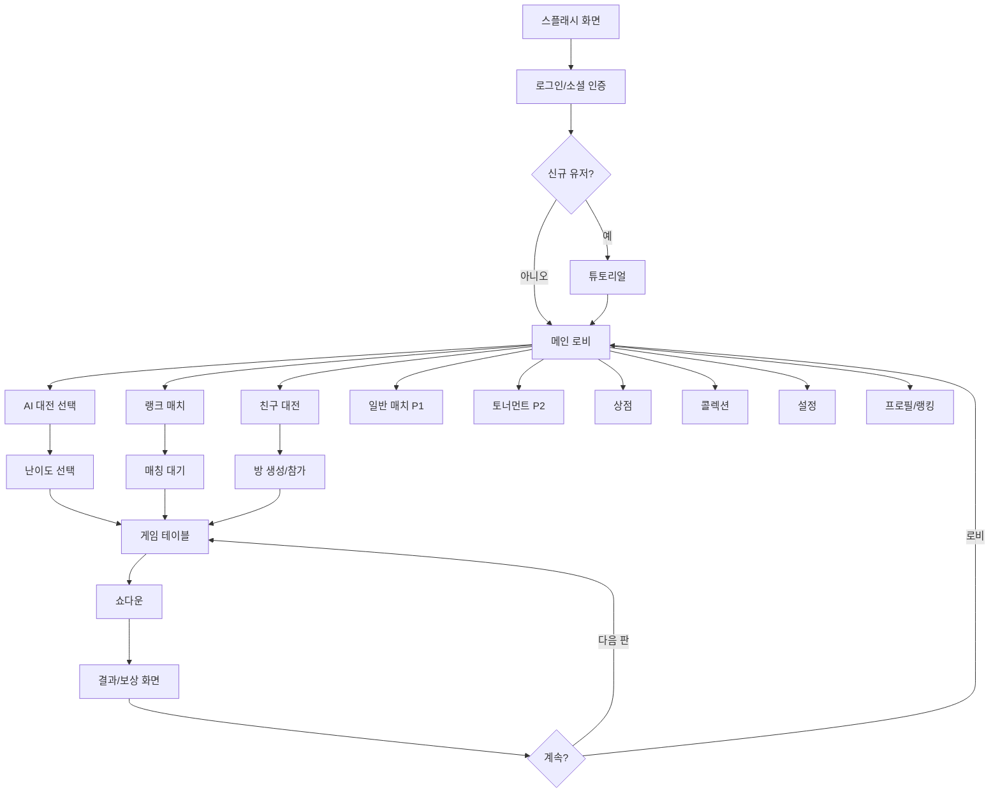

# 로우 바둑이 (Low Baduki) — Game Design Document (GDD)

**작성일**: 2026-02-27
**버전**: 1.0
**프로젝트 유형**: 게임 개발 (SIGIL S3)
**엔진**: Unity 6.3 LTS
**플랫폼**: 모바일(Android/iOS) → PC/Steam → 웹(WebGL)
**입력 문서**:
- S1 통합 리서치: `01-research/projects/baduki/2026-02-26-s1-integrated-research.md`
- S2 컨셉: `02-product/projects/baduki/2026-02-27-s2-concept.md`

---

## 목차

1. [게임 개요 (Game Overview)](#1-게임-개요)
2. [핵심 메커닉 (Core Mechanics)](#2-핵심-메커닉)
3. [UI/UX 플로우 (UI/UX Flow)](#3-uiux-플로우)
4. [아트 방향 (Art Direction)](#4-아트-방향)
5. [오디오 설계 (Audio Design)](#5-오디오-설계)
6. [경제 설계 (Economy Design)](#6-경제-설계)
7. [콘텐츠 설계 (Content Design)](#7-콘텐츠-설계)
8. [기술 요구사항 (Technical Requirements)](#8-기술-요구사항)
9. [관리자 도구 (Admin Tools)](#9-관리자-도구)
10. [리스크 및 법률/심의](#10-리스크-및-법률심의)
11. [부록 (Appendix)](#11-부록)

---

## 1. 게임 개요

### 1.1 High Concept

> **"언제 어디서든 3분 만에 한 판 — 한국 전통 로우 바둑이의 모던 리부트. AI 대전부터 친구 대전까지."**

### 1.2 핵심 재미 요소 (Core Fantasy)

플레이어가 느끼는 핵심 감정:
- **전략적 긴장감**: 3회 드로우에서 버릴 카드를 고르는 순간의 두뇌 싸움
- **블러핑의 쾌감**: 약한 핸드로 상대를 폴드시키는 심리전 승리
- **성장 체감**: ELO 상승과 랭크 승급으로 실력이 수치로 증명됨
- **빠른 만족감**: 3-5분 한 판, 승패 즉시 확인 — 출퇴근 시간에 딱 맞는 세션

### 1.3 장르 및 서브장르

| 구분 | 내용 |
|------|------|
| **메인 장르** | 턴제 카드 게임 (Turn-Based Card Game) |
| **서브장르** | 포커 변형 — 로우볼 (Lowball Poker Variant) |
| **게임플레이 특성** | 드로우 포커 (Draw Poker) + 블러핑 심리전 |
| **세션 유형** | 캐주얼 (3-5분/판) |
| **소셜 구조** | 멀티플레이어 (2-4인) + AI 싱글플레이 |

### 1.4 타겟 유저

| 세그먼트 | 연령 | 동기 | 월 지출 | 수익 기여 | 우선순위 |
|---------|------|------|:------:|:-------:|:------:|
| **전략형 경쟁자** | 20-40대 남성 | 승리, 순위 상승, 실력 증명 | $15-80 | 40-50% | **1순위** |
| **사교형 애호가** | 30-50대 | 친구/지인과 함께 즐기기 | $5-20 | 20-30% | **2순위** |
| **향수형 레트로** | 50대+ | 예전 바둑이 감성, 편안함 | $2-5 | 5-10% | 3순위 |
| **하드코어 챌린저** | 20-30대 | 최고 랭크 달성, GTO 연구 | $40-100+ | 20-30% | 4순위 |

**Early Adopter**: 전략형 경쟁자 (20-40대 남성, 한게임/피망 현재 유저 중 UI 불만층)

**핵심 동기 (한국 게이머 기준)**:

| 동기 | 비중 | 게임 설계 함의 |
|------|:---:|-------------|
| 사회적 연결 | 36.1% | 친구 초대, 이모지 채팅 |
| 성장/진행 | 24.6% | ELO 랭크, 시즌 보상 |
| 경쟁/실력 | 19.3% | 토너먼트, 래더 |
| 시간 효율 | 18.2% | 3-5분 세션 |

### 1.5 USP (Unique Selling Point)

1. **로우 바둑이 전문**: 범용 포커 앱이 아닌 로우 바둑이 특화 UX/튜토리얼. 기존 3사(한게임/피망/윈조이)는 로우 바둑이를 서브 모드로만 제공.
2. **AI 대전 3단계**: Unity Inference Engine 온디바이스 추론 — 서버 비용 $0, 인터넷 없이도 플레이. Easy(입문) / Medium(숙련) / Hard(GTO 기반).
3. **모던 프리미엄 UX**: 10년+ 노후된 경쟁사 UI 대비 깔끔한 레이아웃 + 고급 질감 + 부드러운 카드 애니메이션.

---

## 2. 핵심 메커닉

### 2.1 코어 루프 (Core Loop)

```
[앱 진입] ──→ [로비] ──→ [매칭/방 선택] ──→ [게임 플레이]
    ↑                                              ↓
    └────────── [다음 판] ←── [보상 화면] ←── [쇼다운/결과]
                                  ↓
                         [성장 시스템 업데이트]
                    (ELO 변동 / 경험치 / 시즌 패스)
```

**단계별 시간 목표**:

| 단계 | 목표 시간 | 설명 |
|------|---------|------|
| 매칭 대기 | 30초 이내 | ELO ±50 범위 우선, 최대 30초 후 확장 |
| 게임 플레이 | 3-5분 | 4라운드 베팅 + 3회 드로우 |
| 결과/보상 | 20-30초 | 쇼다운 애니메이션 + 보상 팝업 |
| 성장 업데이트 | 10초 | ELO 변동, 시즌 패스 진행도 |

**3단계 루프 구조**:

```
[단기 루프] 판 → 승/패 → 코인 + 경험치 → 다음 판
      ↓
[중기 루프] 레벨업 → 코스메틱 해금 → ELO 랭크 승급
      ↓
[장기 루프] 시즌 보상 → 배틀패스 완료 → 콜렉션 완성
```

### 2.2 게임 규칙

#### 2.2.1 기본 정보

| 항목 | 내용 |
|------|------|
| 덱 | 표준 52장 (A~K × 4무늬: 스페이드♠ 하트♥ 다이아♦ 클럽♣) |
| 핸드 크기 | 4장 |
| 플레이어 수 | 2-4인 (AI 포함) |
| 드로우 횟수 | 3회 (1차: 아침, 2차: 점심, 3차: 저녁) |
| 베팅 라운드 | 4회 (프리드로우 + 3회 드로우 후) |
| 목표 | 가장 낮은 핸드 보유자 승리 |

#### 2.2.2 게임 진행 순서

```
Step 1: 블라인드 설정
  - Small Blind (SB): 딜러 왼쪽 첫 번째 플레이어
  - Big Blind (BB): 딜러 왼쪽 두 번째 플레이어
  - SB = BB의 절반

Step 2: 초기 핸드 배분
  - 각 플레이어에게 4장씩 뒷면으로 배분

Step 3: 1라운드 베팅 (프리드로우)
  - BB 기준으로 시계 방향 베팅
  - 액션: Fold / Check / Call / Raise

Step 4: 1차 드로우 (아침)
  - 각 플레이어 0-4장 선택하여 교환 (비공개)
  - 교환 장수는 다른 플레이어에게 공개됨

Step 5: 2라운드 베팅

Step 6: 2차 드로우 (점심)

Step 7: 3라운드 베팅

Step 8: 3차 드로우 (저녁)

Step 9: 4라운드 베팅

Step 10: 쇼다운
  - 남은 플레이어 핸드 공개
  - 족보 비교 → 승자 팟 획득
```

#### 2.2.3 족보 (Hand Rankings) — 낮을수록 강함

**Made Hand 판정 조건**: 4장의 무늬가 모두 다르고, 4장의 숫자가 모두 다름

| 급 | 족보명 | 설명 | 예시 |
|----|-------|------|------|
| **1급** | **메이드 (Made/Badugi)** | 4장 모두 무늬 다름 + 숫자 다름 | A♠2♣3♦4♥ |
| **2급** | **베이스 (Three-Card)** | 3장만 다른 무늬/숫자, 1장 중복 | A♠2♣3♦3♥ |
| **3급** | **투베이스 (Two-Card)** | 2장씩 쌍으로 중복 | A♠2♣A♦2♥ |
| **4급** | **노페어 (One-Card)** | 모든 카드가 같은 무늬 또는 숫자 | A♠2♠3♠4♠ |

**메이드 내 족보 비교** (숫자가 낮을수록 강함):

| 순위 | 족보명 | 구성 | 비고 |
|------|-------|------|------|
| 1위 | Perfect/골프 | A-2-3-4 (최강) | "골프"라고 부름 |
| 2위 | Second | A-2-3-5 | |
| 3위 | Third | A-2-4-5 | |
| ... | ... | 가장 높은 카드 비교 | 낮을수록 강함 |
| 최약 | K-high | K-Q-J-10 | |

**비교 규칙**: 같은 급 내에서는 가장 높은 카드부터 순서대로 비교 → 낮은 카드 보유자 승리.
메이드(1급)는 항상 베이스(2급)보다 강함.

#### 2.2.4 블라인드 구조

| 테이블 | Small Blind | Big Blind | 최소 바이인 |
|--------|:-----------:|:---------:|:---------:|
| 연습 테이블 | 10 | 20 | 400 |
| 일반 테이블 | 50 | 100 | 2,000 |
| 하이롤러 테이블 | 500 | 1,000 | 20,000 |

#### 2.2.5 시간 제한

| 상황 | 제한 시간 | 만료 시 |
|------|---------|--------|
| 베팅 액션 | 20초 | 자동 Check (가능 시) 또는 Fold |
| 드로우 선택 | 15초 | 자동 Stand Pat (0장 교환) |
| 경고 타이머 | 5초 남을 때 | 시각적/음향 경고 |

### 2.3 플레이어 액션

| 액션 | 상황 | 입력 | 결과 | 피드백 |
|------|------|------|------|--------|
| **Fold** | 베팅 라운드 | 버튼 탭 | 팟 포기, 게임 이탈 | 카드 뒤집기 애니메이션 |
| **Check** | 베팅 없을 때 | 버튼 탭 | 패스, 다음 플레이어로 | 체크 사운드 |
| **Call** | 이전 베팅 있을 때 | 버튼 탭 | 현재 베팅액 맞춤 | 칩 이동 애니메이션 |
| **Raise** | 언제나 | 금액 슬라이더 + 확인 | 베팅액 인상 | 칩 스택 증가 애니메이션 |
| **All-in** | 언제나 | 전용 버튼 | 보유 칩 전부 베팅 | 화면 강조 + 사운드 |
| **드로우 선택** | 드로우 라운드 | 카드 탭하여 선택 | 선택 카드 하이라이트 | 선택/해제 토글 |
| **드로우 확정** | 드로우 라운드 | 확인 버튼 | 선택 카드 교환 | 카드 플립 애니메이션 |
| **Stand Pat** | 드로우 라운드 | 0장 선택 후 확인 | 교환 없이 패스 | 특수 사운드 |

### 2.4 승리/패배 조건

**승리**: 쇼다운에서 가장 낮은 족보 보유 또는 모든 상대가 Fold한 마지막 생존자

**패배**: Fold 또는 쇼다운에서 상대보다 높은 족보 보유

**무승부 (Tie)**: 완전히 동일한 족보 → 팟 균등 분배

**게임 종료 조건**:
- AI 대전: 1판 (단판 승부)
- 랭크 매치: 1판 (ELO 반영)
- 친구 대전: 설정된 판 수 (기본 3판)
- 토너먼트: 칩 소진 시 탈락

### 2.5 Luck vs Skill 비율

**종합 비율**: Luck 40% / Skill 60%

| 게임 단계 | Luck | Skill | 설명 |
|---------|:----:|:-----:|------|
| 초기 핸드 배분 | 60% | 40% | 어떤 카드를 받는지는 운 |
| 드로우 (3회) | 40% | 60% | 어떤 카드를 버릴지는 스킬 |
| 베팅/블러핑 | 20% | 80% | 순수 심리 + 확률 게임 |

**근거**: 초보자도 가끔 이기지만 (운 40%), 장기적으로 경험자가 우위 (스킬 60%). 모바일 캐주얼의 적정 재미 범위.

**밸런싱 원칙**:
- Luck 60%+ → 초보자 승률 과다, 경험자 이탈
- Luck 40% / Skill 60% → 초보자도 이길 희망 + 경험자의 장기 우위 (목표 밸런스)
- Luck 30%- → 초보자 지속 패배, 진입장벽 높음

---

## 3. UI/UX 플로우

### 3.1 전체 화면 맵



### 3.2 주요 화면별 상세

#### 화면 1: 스플래시 화면 (Splash Screen)

- **진입 조건**: 앱 최초 실행
- **화면 요소**: 게임 로고 + 로딩 바 + 버전 표시
- **지속 시간**: 최대 3초 (Firebase 초기화 + 에셋 로드)
- **이탈 경로**: 자동 → 로그인 화면

#### 화면 2: 로그인/소셜 인증 (Login)

- **진입 조건**: 스플래시 완료 또는 세션 만료
- **화면 요소**:
  - 게임 타이틀 로고 + 키비주얼
  - Google 로그인 버튼
  - Apple 로그인 버튼 (iOS)
  - 게스트 플레이 버튼 (제한적 기능)
  - 버전 정보 (하단)
- **유저 액션**: 소셜 로그인 → Firebase Authentication / 게스트 → 로컬 UUID
- **이탈 경로**: 로그인 성공 → 메인 로비 (신규 유저는 튜토리얼)

#### 화면 3: 튜토리얼 (Tutorial)

- **진입 조건**: 신규 유저 첫 로그인
- **구성**: 인터랙티브 5단계 (건너뛰기 불가)
  1. 바둑이란? — 족보 설명 (Made/베이스/투베이스/노페어)
  2. 카드 교환 — 드로우 메커닉 실습
  3. 베팅 — Fold/Check/Call/Raise 실습
  4. 골프(Perfect) 만들기 — 목표 핸드 달성 실습
  5. 첫 AI 대전 (Easy) — 1판 완주
- **완료 보상**: 코인 500 + 기본 카드 스킨 1종
- **재시청**: 설정 > 튜토리얼 다시 보기
- **이탈 경로**: 완료 → 메인 로비

#### 화면 4: 메인 로비 (Main Lobby)

- **진입 조건**: 로그인 완료
- **화면 요소**:
  - 상단바: 코인 잔액 / 젬(프리미엄 재화) 잔액 / 프로필 아이콘
  - 중앙: 게임 모드 버튼 (AI 대전 / 랭크 매치 / 친구 대전 / 일반 매치 / 토너먼트)
  - 하단 탭바: 홈 / 상점 / 콜렉션 / 랭킹 / 프로필
  - 시즌 패스 진행도 바 (상단)
  - 일일 미션 알림 뱃지
- **유저 액션**: 모드 선택 / 탭 이동 / 상점 진입

#### 화면 5: AI 대전 선택 (AI Mode Select)

- **진입 조건**: 로비에서 AI 대전 선택
- **화면 요소**:
  - 난이도 3단계 선택 카드 (Easy / Medium / Hard)
  - 각 난이도별 설명 및 적합 대상
  - AI 봇 아바타 및 이름 표시
  - 플레이어 수 선택 (1v1 / 1v2 / 1v3)
- **Hard 잠금 조건**: 튜토리얼 완료 후 1개월 뒤 해금 (서버 피처 플래그)
- **유저 액션**: 난이도 선택 → 게임 시작

#### 화면 6: 매칭 대기 (Matchmaking)

- **진입 조건**: 랭크/일반 매치 선택
- **화면 요소**: 대기 중 애니메이션 (카드 셔플) / 현재 ELO / 예상 대기 시간 / 취소 버튼
- **매칭 로직**:
  - 0-5초: ELO ±50 범위
  - 5-10초: ELO ±100 범위
  - 10-20초: ELO ±150 범위
  - 20-30초: ELO ±200 범위
  - 30초 초과: 전체 ELO 허용 또는 AI 봇 투입 (일반 매치만)

#### 화면 7: 게임 테이블 (Game Table)

- **진입 조건**: 매칭 완료 또는 AI 대전 시작
- **화면 레이아웃**:

```
┌─────────────────────────────────────────┐
│  [상대 플레이어] ELO / 닉네임 / 아바타    │
│  [상대 핸드] ■ ■ ■ ■ (뒷면)             │
├─────────────────────────────────────────┤
│         [팟 정보] POT: 200              │
│       [테이블/보드 배경 영역]             │
│       [현재 드로우 단계 표시]             │
│       (아침 / 점심 / 저녁)               │
├─────────────────────────────────────────┤
│  [내 핸드] 4장 앞면 (탭으로 드로우 선택)  │
│  [족보 자동 계산] "현재: 베이스"          │
│                                         │
│  [Fold] [Check/Call] [Raise] [All-in]  │
│  [금액 슬라이더] SB:50 / BB:100         │
│  [타이머 바] ████████░░ 20초            │
└─────────────────────────────────────────┘
```

- **드로우 모드**: 베팅 UI ↔ 드로우 선택 UI 전환
- **족보 자동 계산**: 카드 교환 후 실시간 족보 표시
- **이모지 채팅**: 좌측 버튼 탭 → 이모지 팔레트 팝업 (6개 기본)
- **이탈 경로**: 메뉴 버튼 → 게임 설정 팝업 (게임 포기 옵션 포함)

#### 화면 8: 쇼다운 (Showdown)

- **진입 조건**: 4라운드 베팅 완료 (남은 플레이어 2인 이상)
- **화면 요소**: 전체 카드 앞면 공개 애니메이션 → 족보 비교 강조 → 승자 골드 테두리 → 팟 이동
- **지속 시간**: 3-5초 애니메이션
- **이탈 경로**: 자동 → 결과/보상 화면

#### 화면 9: 결과/보상 화면 (Result)

- **진입 조건**: 쇼다운 완료 또는 단독 생존 승리
- **화면 요소**:
  - 승/패 대형 표시
  - 이번 판 손익 (코인 +/-)
  - 경험치 획득량 + 레벨업 애니메이션 (해당 시)
  - ELO 변동 표시 (랭크 매치만)
  - 시즌 패스 진행도 업데이트
  - 리워드 광고 버튼 (패배 시: "광고 보고 코인 100 획득")
- **버튼**: [다음 판] [로비]
- **자동 닫힘**: 10초 후 로비 복귀

#### 화면 10: 친구 대전 방 (Friend Room)

- **진입 조건**: 친구 대전 선택
- **화면 요소**:
  - [방 만들기] / [방 코드 입력] 탭
  - 방 설정: 블라인드 크기 / 판 수
  - 초대 링크 복사 버튼
  - 입장한 플레이어 목록 (최대 4인)
  - 준비 완료 버튼
- **딥링크**: `baduki://room/{roomCode}` — 외부 공유 후 앱 직접 진입

### 3.3 네비게이션 패턴

- **뒤로가기 동작**: 게임 중 = 확인 팝업 → 포기 시 ELO 패널티 경고
- **딥링크 지원**: 친구 초대 링크 (`baduki://room/{code}`)
- **앱 백그라운드**: 게임 중 백그라운드 전환 시 20초 후 자동 폴드 처리

---

## 4. 아트 방향

### 4.1 시각 스타일

**선택된 스타일: 모던 프리미엄 (Modern Premium)**

> 깔끔한 레이아웃 + 고급 질감 + 부드러운 애니메이션

**선택 근거**: 1순위 타겟(20-40대 전략형)의 "고급스러움"과 2순위(30-50대 사교형)의 "친숙함" 모두 충족.

**참고 레퍼런스**:
- 레이아웃: Balatro (깔끔한 카드 배치)
- 질감: 프리미엄 카지노 앱 (펠트 텍스처, 골드 악센트)
- 애니메이션: Marvel SNAP (부드러운 카드 플립)

### 4.2 컬러 팔레트

| 용도 | 색상명 | HEX |
|------|--------|-----|
| **배경 (테이블)** | Deep Felt Green | `#1A3A2A` |
| **배경 (로비)** | Midnight Navy | `#0D1B2A` |
| **주요 액션 버튼** | Premium Gold | `#C9A84C` |
| **보조 버튼** | Silver White | `#E8E8E8` |
| **승리 강조** | Vibrant Gold | `#FFD700` |
| **패배 강조** | Soft Red | `#CC3333` |
| **카드 배경** | Pure White | `#FFFFFF` |
| **카드 무늬 (빨강)** | Classic Red | `#CC0000` |
| **카드 무늬 (검정)** | Rich Black | `#1A1A1A` |
| **UI 텍스트** | Light Cream | `#F5F0E8` |
| **HUD 배경** | Dark Glass | `#00000080` (반투명) |

### 4.3 에셋 가이드 (Unity AI Generators 활용)

| 에셋 유형 | 사양 | 수량 | 생성 방법 |
|----------|------|:---:|---------|
| 카드 기본 덱 (52장) | 256x384px, PNG | 52 | Unity AI Generators |
| 카드 뒷면 디자인 | 256x384px, PNG | 5종 | Unity AI Generators |
| 코스메틱 카드 스킨 | 256x384px, PNG | 20종+ | Unity AI Generators |
| 테이블 배경 | 1920x1080px, PNG | 5종 | Unity AI Generators |
| UI 아이콘 | 64x64px, PNG | 50+ | Unity AI Generators |
| 플레이어 아바타 | 128x128px, PNG | 20종 | Unity AI Generators |
| 이모지 세트 | 64x64px, PNG | 30종 | Unity AI Generators |
| 키비주얼/스플래시 | 1080x1920px | 3종 | Stitch / NanoBanana |
| 앱 아이콘 | 1024x1024px, PNG | 1 | Stitch / NanoBanana |
| 칩/토큰 | 128x128px, PNG | 5종 | Unity AI Generators |

**Sprite Atlas 설정**:
- 카드 스프라이트 → `CardAtlas.spriteatlas` (52장 + 뒷면 한 파일)
- UI 아이콘 → `UIAtlas.spriteatlas`
- ASTC 6x6 압축 (모바일 메모리 75% 절감)

**Unity AI Generators 프롬프트 예시**:
- 카드: "Premium minimalist playing card [rank][suit], clean white background, gold accent, Korean style"
- 테이블: "Dark green felt poker table texture, subtle grid pattern, premium casino aesthetic"
- 아바타: "Cartoon portrait avatar, [gender/style], friendly expression, circle crop ready"

### 4.4 애니메이션 가이드

| 애니메이션 | 트리거 | 지속시간 | 이징 | 생성 방법 |
|-----------|--------|:-------:|------|---------|
| 카드 배분 | 게임 시작 | 0.8초 | Ease Out Cubic | Unity AI Generators |
| 카드 교환 | 드로우 확정 | 0.5초 | Ease In-Out | Unity AI Generators |
| 카드 뒤집기 (쇼다운) | 쇼다운 단계 | 0.3초/장 | Ease Out Back | Unity AI Generators |
| 칩 이동 | 베팅/팟 분배 | 0.6초 | Ease Out Quart | DOTween |
| 승리 이펙트 | 승리 확정 | 2초 | - | Unity AI Generators |
| ELO 상승 | 결과 화면 | 1초 | Ease Out | Unity 코드 |
| 레벨업 | 경험치 초과 | 1.5초 | - | Unity Particle System |
| 버튼 탭 | 모든 버튼 | 0.1초 | Ease Out | Unity Scale |
| 타이머 경고 | 5초 이하 | 반복 | - | 색상 Lerp (녹→적) |

---

## 5. 오디오 설계

### 5.1 BGM 방향

| 장면 | 분위기 | 스타일 | 생성 방법 |
|------|--------|--------|---------|
| 메인 로비 | 편안하고 세련된 | 재즈 피아노 + 저음 베이스 | Unity AI Generators |
| 게임 중 (평상시) | 집중 유도 | 미니멀 일렉트로닉 | Unity AI Generators |
| 게임 중 (마지막 드로우) | 긴장감 고조 | BPM 증가, 퍼커션 추가 | Unity AI Generators |
| 승리 | 성취감, 상쾌함 | 팡파레 + 상승 멜로디 | Unity AI Generators |
| 패배 | 아쉬움 | 짧고 부드러운 하강 | Unity AI Generators |

**BGM 전환**: 크로스페이드 (0.5초). 타이머 5초 이하 시 자동 템포 업.

### 5.2 SFX 목록

| 이벤트 | 효과음 설명 | 우선순위 |
|--------|-----------|:-------:|
| 카드 배분 | 부드러운 카드 슬라이딩 + 착지 | P0 |
| 카드 선택 (드로우) | 카드 탭 소리 | P0 |
| 카드 교환 | 카드 셔플 + 배분 | P0 |
| 칩 베팅 | 칩 쌓이는 소리 | P0 |
| Fold | 카드 내려놓는 소리 | P0 |
| 쇼다운 카드 공개 | 카드 뒤집는 소리 × 4 | P0 |
| 승리 | 팡파레 + 칩 쏟아지는 소리 | P0 |
| 패배 | 짧은 탄식음 | P0 |
| 골프 달성 (Perfect) | 특수 효과음 + 화면 연출 | P1 |
| 이모지 전송 | 귀여운 팝 소리 | P1 |
| 레벨업 | 상승 차임벨 | P1 |
| 타이머 경고 | 시계 째깍 소리 | P0 |
| 버튼 탭 | 부드러운 클릭 | P0 |

**모든 SFX**: Unity AI Generators로 생성

### 5.3 음성/내레이션

- **출시 시**: 없음 (텍스트 튜토리얼만)
- **P1 업데이트**: AI 딜러 음성 (한국어) — Unity AI Generators로 저비용 구현 검토

**음량 기본값**: BGM 40% / SFX 70% (개별 조절 가능)

---

## 6. 경제 설계

### 6.1 통화 시스템

| 통화 | 획득 방법 | 사용처 | 싱크(소멸) |
|------|---------|--------|---------|
| **코인 (기본 재화)** | 일일 보너스, 승리 보상, 광고 시청, 레벨업 | 테이블 참가비, 코스메틱 일부 | 게임 참가비 |
| **젬 (프리미엄 재화)** | IAP 구매, 배틀패스 보상(소량), 이벤트 | 코스메틱 구매, 탄 구매(ON 시) | 구매 즉시 |
| **배틀패스 포인트 (BP)** | 게임 참가 + 승리 + 미션 | 배틀패스 보상 해금 | 시즌 종료 리셋 |
| **이벤트 토큰** | 이벤트 참여 | 이벤트 상점 | 이벤트 종료 |

**코인 인플레이션 방지**:
- 테이블 참가비로 지속 소멸
- 코인 직접 판매 없음 (젬 → 코인 환전만 가능, 반대 불가)
- 일일 접속 보너스: 200코인 (7일 연속 2,000코인 보너스)

### 6.2 수익화 모델

| 수익원 | 비중 | 설명 |
|--------|:---:|------|
| **코스메틱 IAP** | 60% | 카드 스킨, 보드 테마, 이모지, 프로필 프레임 |
| **리워드 광고** | 20% | 패배 후 코인 획득, 일일 무료 코인, 연속 플레이 보너스 |
| **배틀패스** | 15% | 시즌 패스 프리미엄 트랙 |
| **VIP 구독** | 5% | 광고 제거 + 일일 보너스 + 전용 이모지 |

**탄 시스템** (피처 플래그 의존):
- 심의 시: `FEATURE_TAN_SYSTEM = false` (UI 및 로직 완전 비활성화)
- 서비스 시: 관리자 툴에서 ON → IAP 60% 내 10-15% 차지

### 6.3 인앱 구매 항목

#### 카드 스킨 (단건 IAP)

| 상품명 | 가격 | 내용 |
|--------|------|------|
| 골드 클래식 카드 스킨 | ₩1,990 | 52장 금색 테마 |
| 블루 로얄 카드 스킨 | ₩1,990 | 52장 남색 테마 |
| 다크 미스터리 카드 스킨 | ₩2,490 | 52장 검은색 + 은색 |
| 한국 전통 카드 스킨 | ₩2,490 | 52장 한국화 모티프 |
| 프리미엄 스킨 번들 (4종) | ₩6,990 | 단건 대비 30% 할인 |

#### 보드 테마 (단건 IAP)

| 상품명 | 가격 | 내용 |
|--------|------|------|
| 프리미엄 카지노 보드 | ₩1,490 | 벨벳 테이블 + 골드 테두리 |
| 나무결 전통 보드 | ₩1,490 | 원목 느낌 한국 전통 |
| 밤하늘 보드 | ₩1,990 | 별 반짝임 애니메이션 포함 |

#### 젬 충전 (소모품 IAP)

| 상품명 | 가격 | 젬 수량 | 보너스 |
|--------|------|:------:|------|
| 소량 젬 | ₩1,200 | 100젬 | - |
| 중량 젬 | ₩5,900 | 550젬 | +10% |
| 대량 젬 | ₩11,900 | 1,200젬 | +20% |
| 최대 젬 | ₩59,000 | 7,000젬 | +40% |

#### 배틀패스 (시즌별 IAP)

| 상품명 | 가격 | 내용 |
|--------|------|------|
| 시즌 패스 프리미엄 | ₩4,900 | 무료 30단계 + 프리미엄 30단계 |
| 시즌 패스 + 레벨업 × 10 | ₩9,900 | 프리미엄 패스 + 즉시 10단계 |

#### VIP 구독 (월 정기 IAP)

| 상품명 | 가격 | 내용 |
|--------|------|------|
| VIP 월간 구독 | ₩2,900/월 | 광고 제거 + 일일 100젬 + VIP 이모지 5종 |

#### 탄 시스템 (피처 플래그 ON 시만 노출)

| 상품명 | 가격 | 내용 |
|--------|------|------|
| 엿보기 탄 × 3 | ₩990 | 상대 카드 1장 확인 × 3회 |
| 교체 탄 × 3 | ₩990 | 추가 드로우 기회 × 3회 |
| 탄 콤보 팩 | ₩2,490 | 엿보기 탄 × 5 + 교체 탄 × 5 |

### 6.4 LTV/ARPU 목표

| 지표 | 목표값 | 근거 |
|------|--------|------|
| D1 리텐션 | 40%+ | 소프트 런치 기준 |
| D7 리텐션 | 20%+ | 소프트 런치 기준 |
| D30 리텐션 | 10%+ | 정식 출시 1개월 |
| ARPU (월) | $1-3 | 정식 출시 3개월 |
| ARPPU (월) | $15-25 | Dolphin 기준 |
| 유료 전환율 | 3%+ | 소프트 런치 목표 |
| DAU/MAU | 20%+ | 정식 출시 3개월 |
| BEP | MAU 10,000 | $20,000/월 운영비 커버 |

### 6.5 밸런싱 수치 테이블

#### 코인 획득/소모 균형

| 이벤트 | 코인 |
|--------|:---:|
| 일일 접속 보너스 | +200 |
| 7일 연속 접속 보너스 | +2,000 |
| 일반 테이블 승리 | +80 |
| 일반 테이블 패배 (경험치 보상) | +20 |
| 일반 테이블 참가비 | -50 |
| 광고 시청 (1회) | +100 |
| 레벨업 보상 | +500 |

#### ELO 변동 공식

```
새로운 ELO = 이전 ELO + (K × (Actual - Expected))

Expected = 1 / (1 + 10^((상대 ELO - 내 ELO) / 400))
Actual   = 1 (승리) / 0 (패배)

K값:
  신규 (ELO < 1200, 게임 < 30판): K = 64
  일반 (ELO 1200-1500):           K = 32
  상위 (ELO > 1500):              K = 16
```

#### ELO 티어

| ELO 범위 | 티어명 | 아이콘 색상 |
|---------|--------|---------|
| 900 미만 | 브론즈 | Brown |
| 900-1100 | 실버 | Silver |
| 1100-1300 | 골드 | Gold |
| 1300-1500 | 플래티넘 | Teal |
| 1500-1700 | 다이아몬드 | Blue |
| 1700+ | 레전드 | Gold + 특수 이펙트 |

#### 시즌 리셋 공식

```
리셋 ELO = 900 + (이전 시즌 ELO - 900) × 0.75

예시: 이전 1400 → 리셋 후 1275
     이전 1700 → 리셋 후 1500
```

---

## 7. 콘텐츠 설계

### 7.1 게임 모드

| 모드 | 우선순위 | 출시 시기 | ELO 반영 | 설명 |
|------|:-------:|---------|:-------:|------|
| **AI 대전** | P0 | 출시 | X | 1v1~1v3, 3단계 난이도, 오프라인 가능 |
| **튜토리얼** | P0 | 출시 | X | 인터랙티브 5단계, 신규 유저 필수 |
| **랭크 매치** | P0 | 출시 | O | ELO 기반 자동 매칭, 시즌 보상 |
| **친구 대전** | P0 | 출시 | X | 방 생성 + 링크 초대, 커스텀 설정 |
| **일반 매치** | P1 | +1개월 | X | 빠른 매칭, 부담 없는 플레이 |
| **토너먼트** | P2 | +3개월 | X | 8/16/32인 녹아웃, 주간 이벤트 |

### 7.2 AI 봇 설계

| 난이도 | 이름 | 알고리즘 | 블러핑 | 응답시간 | 잠금 조건 |
|--------|------|---------|:-----:|:-------:|---------|
| **Easy** | 바둑이 초보 | Rule-Based LUT | 1% | <100ms | 없음 |
| **Medium** | 바둑이 중수 | Heuristic + MCTS | 20-30% | 0.5-2초 (의도적 지연) | 없음 |
| **Hard** | 바둑이 고수 | 경량 CFR (Unity Inference Engine) | GTO 빈도 | <10ms (NPU) | 튜토리얼 완료 + 1개월 |

**Unity Inference Engine 활용 (Hard AI)**:
- ONNX 형식 경량 CFR 모델 (목표 크기: 50MB 이하)
- 온디바이스 추론 — 서버 의존 없음, 인터넷 불필요
- NPU 가속 (지원 기기 자동 활성화) / CPU 폴백 (<50ms)

**AI 봇 행동 프로파일**:

```
Easy 봇:
  드로우: 항상 메이드 목표
  베팅: 메이드 보유 시 Call/Check, 미보유 시 80% Fold
  블러핑: 없음 (1% 무작위)

Medium 봇:
  드로우: 족보 기대값 계산 (상위 50% 핸드 유지)
  베팅: 팟 오즈 기반, 20-30% 블러핑
  상대 모델링: 드로우 장수 추적 → 핸드 강도 추정

Hard 봇:
  CFR 모델 조회 → 내시 균형 기반 전략
  블러핑: GTO 빈도 (팟 크기 및 상대 패턴 기반)
  적응형: 플레이어 패턴 분석 후 Exploit 전략 혼합
```

### 7.3 시즌 시스템

**시즌 주기**: 월간 (매월 1일 시작)

| 이벤트 | 날짜 | 설명 |
|--------|------|------|
| 시즌 시작 | 1일 | ELO 소프트 리셋 (75% 유지), 배틀패스 초기화 |
| 시즌 진행 | 1-25일 | 랭크 매치, 배틀패스 미션 |
| 시즌 종료 예고 | 26-28일 | 랭킹 확정, 막판 스퍼트 알림 |
| 시즌 결산 | 말일 23:59 | 보상 지급, 다음 시즌 예고 |

**시즌 랭킹 보상**:

| 순위 | 보상 |
|------|------|
| Top 1% (레전드) | "레전드" 칭호 + 한정 카드 스킨 + 50,000코인 + 레전드 아바타 프레임 |
| Top 5% (다이아몬드) | "다이아" 칭호 + 20,000코인 + 전용 이모지 3종 |
| Top 10% (플래티넘) | "플래티넘" 칭호 + 10,000코인 |
| Top 25% (골드) | "골드" 칭호 + 5,000코인 |
| Top 50% (실버) | 2,000코인 |
| 참가 보상 | 500코인 (시즌 1판 이상 플레이 시) |

### 7.4 배틀패스 구조

| 트랙 | 단계 | 대표 보상 |
|------|:---:|---------|
| **무료 트랙** | 30단계 | 코인, 기본 이모지, 기본 카드 뒷면 스킨 |
| **프리미엄 트랙** (₩4,900) | +30단계 | 젬, 프리미엄 이모지, 프리미엄 카드 스킨, 보드 테마, 시즌 전용 아이템 |

**배틀패스 포인트 획득**:
- 게임 1판 참여: +10 BP
- 랭크 매치 승리: +25 BP
- 일일 미션 완료: +30-50 BP
- 주간 미션 완료: +150 BP

### 7.5 소셜 기능

- **친구 시스템**: 게임 내 친구 추가 (Firebase UID 기반) + 외부 링크 공유
- **이모지 채팅**: 게임 중 이모지만 허용 (텍스트 채팅 없음 — 심의 리스크 방지)
- **리더보드**: 전체 랭킹 / 친구 랭킹 / 시즌 랭킹 3종
- **클럽 시스템** (P2): 최대 30명 클럽, 클럽 내 토너먼트

### 7.6 시즌별 특수 모드 (P1 이후)

| 시즌 | 특수 규칙 | 메타 변화 |
|------|---------|---------|
| 기본 | 정식 로우 바둑이 | 기본 전략 |
| 시즌 2 | 인디언 바둑이 (5장 배분 → 4장 선택) | 스킬 비중 증가 |
| 시즌 3 | 하이로우 바둑이 (팟 50:50 분배) | 이중 전략 |
| 시즌 4 | 스피드 바둑이 (턴 5초 제한) | 직관적 판단 |

---

## 8. 기술 요구사항

### 8.1 엔진 및 프레임워크

| 항목 | 선택 | 버전 | 근거 |
|------|------|------|------|
| **게임 엔진** | Unity | 6.3 LTS | 크로스플랫폼, 2D 최적화, Unity AI 풀 지원 |
| **언어** | C# | .NET 7+ | Unity 표준 |
| **2D 렌더러** | 2D Renderer (URP) | - | 카드 게임 최적화 |
| **물리** | Box2D v3 | - | 카드 애니메이션, 멀티스레드 지원 |
| **UI** | UI Toolkit + TextMesh Pro | - | 모던 UI |
| **AI 추론** | Unity Inference Engine (구 Sentis) | - | 온디바이스 CFR, ONNX 지원 |

**Unity AI 3대 기능 적용 계획**:

| 기능 | 적용 영역 | 구체 사례 |
|------|---------|---------|
| **Unity AI Assistant** | 코드 생성, 씬 구성, 디버깅 | 게임 규칙 엔진 C# 클래스, Firebase CRUD, UI 바인딩 |
| **Unity AI Generators** | 에셋 생성 | 카드 52장, 배경 5종, 이모지 30종, SFX 전체 |
| **Unity Inference Engine** | Hard AI 봇 온디바이스 CFR 추론 | ONNX 모델, NPU 가속, 서버 비용 $0 |

### 8.2 최소/권장 사양

#### 모바일 (Android)

| 항목 | 최소 | 권장 |
|------|------|------|
| OS | Android 7.0 (API 24) | Android 11+ (API 30) |
| RAM | 2GB | 4GB+ |
| CPU | 쿼드코어 1.4GHz | 옥타코어 2.0GHz+ |
| GPU | OpenGL ES 3.0 | OpenGL ES 3.2 / Vulkan |
| 저장공간 | 150MB | 300MB+ |
| 네트워크 | 3G (멀티 기능) | LTE/WiFi |

#### 모바일 (iOS)

| 항목 | 최소 | 권장 |
|------|------|------|
| OS | iOS 14.0 | iOS 16.0+ |
| 기기 | iPhone 8 | iPhone 12+ |
| 저장공간 | 150MB | 300MB+ |

#### 성능 목표

| 항목 | 목표값 |
|------|--------|
| 프레임레이트 | 30 FPS 고정 (모바일) / 60 FPS (PC) |
| 메모리 사용량 | < 200MB RAM |
| 초기 로딩 | < 3초 (스플래시 ~ 로비) |
| 앱 크기 | < 100MB (초기 다운로드) |
| 네트워크 패킷 | < 1KB/액션 |

### 8.3 네트워크 아키텍처

**모델**: Server-Authoritative (서버 권한 모델)

```
클라이언트 → 액션 전송 (Fold/Call/Draw 선택)
     ↓
서버 → 유효성 검증 → 게임 로직 실행
     ↓
서버 → 새 게임 상태 브로드캐스트 → 모든 클라이언트
```

**프로토콜**: WebSocket (TCP 기반, 턴 기반 게임에 적합)
**동기화**: 액션 발생 시 즉시
**타임아웃**: 연결 끊김 20초 후 자동 폴드

**네트워크 스택 (단계별)**:

| Phase | 솔루션 | 비용 |
|:-----:|--------|:---:|
| Phase 1 (MVP) | Unity Netcode for GameObjects | $0 |
| Phase 2 (런치) | Photon Fusion | $0 (100 CCU 이하) |
| Phase 3 (스케일) | Photon Fusion 업그레이드 | $95/년+ |

**부정행위 방지 서버 검증 체크리스트**:
```
□ 해당 플레이어의 턴인가?
□ 액션이 현재 게임 단계에 유효한가?
□ 드로우 시 선택 카드가 핸드에 있는가?
□ 베팅 시 충분한 칩이 있는가?
□ 2초 내 중복 요청이 아닌가?
□ 게임 상태가 "playing"인가?
```

### 8.4 서버/백엔드

| 서비스 | 도구 | Phase | 용도 |
|--------|------|:-----:|------|
| **인증** | Firebase Authentication | 1 | Google/Apple/게스트 |
| **데이터베이스** | Firebase Firestore | 1 | 유저 데이터, 매치 기록 |
| **실시간** | Firebase Realtime DB | 1 | 게임 상태 동기화 |
| **분석** | Firebase Analytics | 1 | 행동 분석, 리텐션 |
| **서버리스 로직** | Firebase Cloud Functions | 1-2 | 매칭, 보상, ELO 업데이트 |
| **관리자 백엔드** | Node.js + Express | 2 | 관리자 API |
| **관리자 DB** | PostgreSQL + Redis | 2 | 유저 관리, 모니터링 |

**Firestore 데이터 구조 핵심**:

```json
users/{userId}: {
  "nickname": "string",
  "elo": 1500,
  "level": 10,
  "coins": 5000,
  "gems": 150,
  "cosmetics": {
    "card_skin": "gold_classic",
    "board_theme": "casino_premium",
    "avatar": "avatar_01"
  }
}

matches/{matchId}: {
  "players": ["userId1", "userId2"],
  "state": "playing",
  "mode": "ranked",
  "round": 2,
  "pot": 200,
  "current_turn": "userId1",
  "draw_count": 1
}
```

### 8.5 AI 시스템 (Unity Inference Engine)

**Hard AI 모델 파이프라인**:

```
[오프라인 CFR 학습]
  Python + CFR 라이브러리 → 로우 바둑이 게임 트리 탐색
  → 균형 전략 테이블 생성 → ONNX 형식 내보내기

[Unity 내 배포]
  .onnx 파일 → Assets/AI/ 폴더
  Unity Inference Engine API → 런타임 로드
  NPU 가속 or CPU 폴백

[런타임 추론]
  게임 상태 → 입력 텐서 변환
  → 모델 추론 (<10ms NPU / <50ms CPU)
  → 액션 확률 분포 → 샘플링 → 최종 액션 선택
```

**모델 입력 특징**: 핸드 인코딩(208차원) + 공개 정보(드로우 단계, 팟 크기, 상대 드로우 장수, 베팅 금액, 포지션) = 약 230차원

**모델 목표 크기**: 50MB 이하 (float16 양자화)

### 8.6 제3자 서비스

| 서비스 | 용도 | Phase 1 비용 | Phase 2 비용 |
|--------|------|:-----------:|:-----------:|
| Firebase | 인증, DB, 분석 | $0 (Spark) | $50-200/월 |
| Photon Fusion | 멀티플레이 | - | $0 (100 CCU 이하) |
| Unity AI Generators | 에셋 생성 | $0 | $0 |
| Unity Inference Engine | AI 추론 | $0 | $0 |
| Stitch / NanoBanana | 키비주얼 일러스트 | $0-50 | $0-50 |
| GitHub Actions + GameCI | CI/CD | $0 | $0 |
| Google Play Console | Android 배포 | $25 (1회) | - |
| Apple Developer | iOS 배포 | $99/년 | $99/년 |
| AdMob | 리워드 광고 | $0 | 수익 30% 공유 |

---

## 9. 관리자 도구

### 9.1 개요

관리자 도구는 서비스와 동등 레벨의 독립 웹 앱이다. 게임 운영에 필수적인 기능을 제공하며, 탄 시스템 피처 플래그 제어의 핵심 인터페이스이다.

**기술 스택**:
- 프론트엔드: React 18 + TypeScript + Tailwind CSS
- 실시간: WebSocket + Socket.IO
- 백엔드: Node.js + Express
- 데이터베이스: PostgreSQL + Redis
- 배포: Docker + Nginx

### 9.2 기능 — P0 (출시 전 필수)

#### 유저 관리

| 기능 | 상세 |
|------|------|
| 유저 조회 | UID / 닉네임 / 이메일로 검색 |
| 유저 상세 | ELO, 코인, 레벨, 가입일, 최종 접속, 매치 히스토리 |
| 계정 제재 | 경고 / 채팅 금지 / 일시 정지 / 영구 밴 |
| 코인 지급 | 운영 보상 코인 지급 (로그 기록 필수) |
| 신고 처리 | 신고 목록 조회 및 처리 결과 기록 |

#### 실시간 모니터링 대시보드

| 항목 | 갱신 주기 |
|------|---------|
| 현재 접속자 수 (CCU) | 5초 |
| 진행 중인 게임 수 | 5초 |
| 서버 상태 (응답시간, 오류율) | 10초 |
| 일일 신규 가입자 | 실시간 |
| 일일 매출 | 실시간 |
| 에러 로그 스트림 | 실시간 |

### 9.3 기능 — P1 (출시 후 1개월)

#### 게임 밸런싱

| 기능 | 상세 |
|------|------|
| 블라인드 구조 조정 | 테이블별 SB/BB 값 실시간 변경 (패치 없이) |
| AI 난이도 파라미터 | 블러핑 빈도, 공격성 수치 조정 |
| 리워드 테이블 | 승리/패배/일일 보상 코인량 조정 |
| ELO K값 조정 | 시즌별 ELO 변동 속도 조정 |

#### 피처 플래그 (Feature Flags)

| 플래그 | 기본값 | 설명 |
|--------|:-----:|------|
| `FEATURE_TAN_SYSTEM` | **OFF** | 탄 시스템 전체 ON/OFF (심의 핵심) |
| `FEATURE_TOURNAMENT` | OFF | 토너먼트 모드 |
| `FEATURE_HARD_AI` | OFF | Hard AI 잠금 해제 |
| `FEATURE_SEASON_SPECIAL` | OFF | 시즌별 특수 규칙 모드 |
| `FEATURE_MAINTENANCE` | OFF | 점검 모드 (로그인 차단) |
| `FEATURE_NEW_USER_GIFT` | ON | 신규 유저 추가 보상 |

**탄 시스템 피처 플래그 운용 원칙**:
1. 심의 빌드 배포 전: `FEATURE_TAN_SYSTEM = false` (Firebase Remote Config + 로컬 상수 이중 잠금)
2. 심의 빌드 확인: 탄 UI 미노출, 탄 관련 코드 경로 도달 불가 QA
3. 심의 완료 후: 관리자 툴에서 ON → 서버 재시작 없이 즉시 적용

### 9.4 관리자 접근 권한

| 역할 | 권한 |
|------|------|
| **Super Admin** | 전체 기능 (피처 플래그 포함) |
| **운영자** | 유저 관리, 신고 처리, 모니터링 |
| **CS 담당자** | 유저 조회, 신고 처리 (밴 불가) |
| **분석가** | 읽기 전용 |

---

## 10. 리스크 및 법률/심의

### 10.1 기술적 리스크

| 리스크 | 심각도 | 완화 전략 |
|--------|:-----:|---------|
| Unity Inference Engine 모델 크기 초과 | 중 | float16 양자화 목표 50MB, 초과 시 서버 추론 전환 |
| Firebase 비용 급증 | 중 | 비용 알림 설정, 캐싱 레이어, Blaze 예산 한도 |
| Photon 100 CCU 초과 | 저 | 100 CCU ≈ 10,000 DAU, 도달 전 $95/년 업그레이드 |
| 멀티플레이 동기화 버그 | 고 | 서버 권한 모델 + 집중 QA |
| Android/iOS 빌드 파편화 | 중 | 최소 사양 기기 실기기 테스트 (Galaxy A 시리즈, iPhone 8) |

### 10.2 시장 리스크

| 리스크 | 심각도 | 완화 전략 |
|--------|:-----:|---------|
| 한게임/피망의 즉각 대응 | 중 | 로우 바둑이 전문 + 빠른 신규 콘텐츠 업데이트 |
| 포커 = 도박 이미지 | 중 | "스킬 게임" 포지셔닝, 가상화폐만, 현금환전 절대 금지 |
| 카드 게임 장르 IP 인지도 부족 | 저 | 한국 시장 PMF 검증 후 콘텐츠 확장 |
| 로우 바둑이 유저 지불 의사 미검증 | 중 | 소프트 런치 A/B 테스트로 검증 |

### 10.3 법률/심의

#### 10.3.1 한국 GRAC 등급 심의

| 항목 | 내용 |
|------|------|
| **목표 등급** | 12세 이용가 (2군) |
| **포지셔닝** | "스킬 게임" — 족보와 전략이 핵심 |
| **심의 비용** | 100-150만원 (Phase 2 소프트 런치 전 제출) |
| **사전 협의** | 권장 (게임물관리위원회 사전 협의) |

**심의용 빌드 QA 체크리스트**:
- [ ] `FEATURE_TAN_SYSTEM = false` 컴파일 타임 확인
- [ ] 탄 관련 UI 요소 완전 미노출
- [ ] 탄 관련 코드 경로 접근 불가
- [ ] 가상화폐 → 현금 환전 경로 없음
- [ ] 코인 구매 한도 구현 (월 50만원, 일 10만원)
- [ ] 확률형 아이템 공시 준비 (또는 없음 확인)

#### 10.3.2 규제 준수 항목

| 법규 | 항목 | 구현 방법 |
|------|------|---------|
| **확률형 아이템 공시** (2024.03~) | 배틀패스 및 보상 박스 확률 명시 | 인게임 UI + 홈페이지 공시 |
| **구매 한도** | 월 50만원, 일 10만원 | Firebase Cloud Functions 검증 |
| **PIPA (개인정보보호법)** | 14세 미만 부모 동의 | 가입 시 생년월일 입력 + 14세 미만 차단 |
| **사행행위 규제법** | 현금 환전 금지 | 서버에서 환전 API 없음 |

---

## 11. 부록

### A. 참고 게임 분석

| 게임 | 배울 점 | 피할 점 |
|------|---------|---------|
| **Zynga Poker** | 소셜 훅(Daily Bonus, 친구 선물), 30초 매칭, 3-5분 세션 | AI 약함, 규칙 단순 → 깊이 부족 |
| **Balatro** | 시즌별 메타 변화, 1인 개발 성공 모델 | Joker 시스템은 바둑이에 부적합 |
| **Marvel SNAP** | 6턴 고정으로 빠른 세션 | IP 파워 의존 |
| **Hearthstone** | 11년 장수 운영 구조 | 제작 비용이 방대함 |
| **한게임 포커** | 정식 바둑이 규칙, 무료 칩 시스템 | UI 노후화, AI 약함 — 반면교사 |

### B. 용어 정의

| 용어 | 정의 |
|------|------|
| **로우 바둑이** | 4장 카드로 가장 낮은 핸드를 만드는 포커 변형 게임 |
| **메이드 (Made/Badugi)** | 4장의 무늬가 모두 다르고 숫자도 모두 다른 핸드 |
| **골프** | A-2-3-4 (4가지 다른 무늬) — 로우 바둑이 최강 패 |
| **베이스 (Three-Card)** | 3장만 다른 무늬/숫자, 1장 중복 |
| **투베이스 (Two-Card)** | 2장씩 쌍으로 중복 |
| **드로우** | 핸드의 일부 카드를 교환하는 행위 (3회 기회) |
| **아침/점심/저녁** | 1차/2차/3차 드로우 단계의 한국식 명칭 |
| **Stand Pat** | 드로우 라운드에서 카드를 교환하지 않는 선택 |
| **GTO** | Game Theory Optimal — 수학적으로 최적화된 전략 |
| **CFR** | Counterfactual Regret Minimization — AI 포커 해결 알고리즘 |
| **ELO** | 플레이어 실력 기반 점수 시스템 |
| **팟 (Pot)** | 베팅으로 쌓인 총 금액 |
| **블라인드** | 게임 시작 전 강제 베팅 (SB/BB) |
| **탄 시스템** | 엿보기 탄 + 교체 탄 — 피처 플래그로 ON/OFF |
| **피처 플래그** | 코드 재배포 없이 기능을 ON/OFF하는 서버 설정 |
| **Unity Inference Engine** | Unity 온디바이스 AI 추론 엔진 (구 Sentis), ONNX 지원 |
| **Whale** | 고액 과금 유저 (상위 1-2%, 수익의 70-86% 기여) |
| **Dolphin** | 중간 과금 유저 (상위 10-15%, $25/월) |
| **ARPU** | Average Revenue Per User — 유저당 평균 수익 |
| **DAU/MAU** | 일간/월간 활성 유저 수 |

### C. 출시 로드맵 요약

```
Phase 1: 프로토타입 (Trine 구현 → 유저 테스트)
  목표: AI 대전(Easy/Medium) + 기본 UI + 튜토리얼 + 친구 대전
  검증: 20명 플레이 테스트

Phase 2: 소프트 런치 (한국)
  목표: AI 3단계 + 랭크 매치 + 코스메틱 IAP + 배틀패스 v1
  조건: GRAC 심의 사전 협의 완료

Phase 3: 정식 출시 (한국)
  목표: GRAC 심의 통과 후 공식 출시
  마케팅: ASO + 포커 커뮤니티 + 쇼폼 콘텐츠

```

### D. 변경 이력

| 버전 | 날짜 | 변경 내용 | 작성자 |
|------|------|---------|--------|
| 1.0 | 2026-02-27 | 초안 작성 (S3 GDD) | Claude Sonnet 4.6 (gdd-writer) |

---

**S3 게이트 DoD 체크리스트**:
- [x] 전체 10개 섹션 완성
- [x] 게임 규칙 수치 명시 (족보, 블라인드, ELO 공식, 시간 제한)
- [x] 화면 플로우 10개 화면 상세 기술 (Mermaid + 화면별 요소)
- [x] Unity AI 3대 기능 구체 적용 방법 포함 (섹션 8.1, 4.3, 5.2)
- [x] 수익화 수치 구체화 (IAP 가격표, 비중, 코인 플로우)
- [x] 관리자 도구 기능 상세 (섹션 9, P0/P1 분리)
- [x] 탄 시스템 심의 대응 설계 포함 (섹션 6.2, 9.3, 10.3)
- [x] 법률/심의 항목 명시 (GRAC, 확률 공시, PIPA)
- [x] 기술 스택 Phase별 상세 명시 (네트워크, 백엔드, AI)
- [x] 리스크 및 완화 전략 포함

**다음 단계**: S4 기획 패키지 작성 (상세 기획서, 사이트맵, 로드맵, 개발 계획, WBS, UI/UX 기획서)
