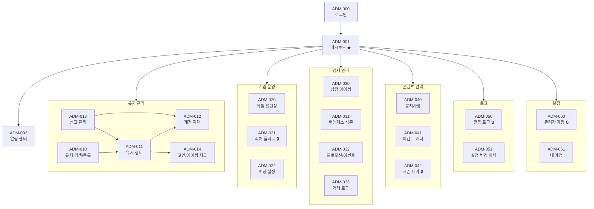

# 로우 바둑이 (Low Baduki) — S4 관리자 사이트맵

**작성일**: 2026-02-27
**프로젝트 유형**: 게임 개발 (SIGIL S4 — 개발 트랙)
**입력 문서**: S3 GDD `02-product/projects/baduki/2026-02-27-s3-gdd.md` 섹션 9 (관리자 도구)
**참조**: 관리자 상세 기획서 `02-product/projects/baduki/2026-02-27-s4-admin-detailed-plan.md`
**버전**: 1.0

---

## 1. 화면 계층 구조

### 1.1 전체 화면 트리

```
로우 바둑이 관리자 (React SPA)
│
├── ADM-000. 로그인
│   ├── 이메일/비밀번호 입력
│   └── 비밀번호 재설정
│
├── [공통 레이아웃] ──────────────────────────────────────
│   │ 상단바: 로고 + 알림(🔔) + 계정(▼) + 로그아웃
│   │ 사이드바: 네비게이션 (역할별 메뉴 필터링)
│   │ 하단바: CCU + 게임 수 + 서버 상태 + 버전
│   │
│   ├── ADM-001. 대시보드 ★ (기본 랜딩)
│   │   ├── 실시간 모니터링 카드 (CCU, 게임, 서버, 가입, 매출)
│   │   ├── KPI 차트 (DAU/MAU, 리텐션, ARPU, 매치 통계, ELO 분포)
│   │   └── 에러 로그 스트림
│   │
│   ├── ADM-002. 알림 센터 (상단바 🔔 클릭)
│   │   ├── 알림 목록 (최신순)
│   │   └── 알림 설정
│   │
│   ├── [유저 관리] ─────────────────────────────────────
│   │   ├── ADM-010. 유저 검색/목록
│   │   │   ├── 검색 폼 (UID/닉네임/이메일/ELO/가입일/상태)
│   │   │   └── 결과 테이블 (페이지네이션)
│   │   │
│   │   ├── ADM-011. 유저 상세 정보
│   │   │   ├── 탭1: 프로필 정보
│   │   │   ├── 탭2: 게임 통계 + 매치 히스토리
│   │   │   ├── 탭3: 구매 내역
│   │   │   ├── 탭4: 관리자 메모
│   │   │   ├── [액션] 제재 → ADM-012
│   │   │   └── [액션] 보상 지급 → ADM-014
│   │   │
│   │   ├── ADM-012. 계정 제재 (모달)
│   │   │   ├── 제재 유형 선택 (경고/채팅금지/정지/영구밴)
│   │   │   ├── 기간 선택
│   │   │   ├── 사유 입력
│   │   │   └── 이중 확인 다이얼로그
│   │   │
│   │   ├── ADM-013. 신고 관리
│   │   │   ├── 신고 목록 (필터: 상태/사유/날짜)
│   │   │   ├── 신고 상세 (모달)
│   │   │   │   ├── 신고 내용 + 게임 로그
│   │   │   │   ├── 피신고자 이력
│   │   │   │   └── 처리 결과 입력
│   │   │   └── 자동 에스컬레이션 알림
│   │   │
│   │   └── ADM-014. 코인/아이템 지급 (모달)
│   │       ├── 지급 항목 선택 (코인/젬/아이템/BP레벨)
│   │       ├── 수량 입력 + 한도 검증
│   │       ├── 사유 입력
│   │       └── 확인 다이얼로그
│   │
│   ├── [게임 운영] ─────────────────────────────────────
│   │   ├── ADM-020. 게임 밸런싱
│   │   │   ├── 탭1: 블라인드 구조 (테이블별 SB/BB)
│   │   │   ├── 탭2: AI 난이도 파라미터 (Easy/Medium/Hard)
│   │   │   ├── 탭3: 리워드 테이블 (보상/출석/광고)
│   │   │   ├── 탭4: ELO 시스템 (K값/시즌 리셋/매칭 범위)
│   │   │   ├── [미리보기] 경제 시뮬레이션
│   │   │   └── [롤백] 설정 변경 이력 + 복원
│   │   │
│   │   ├── ADM-021. 피처 플래그 관리 🔒 Super Admin 전용
│   │   │   ├── 플래그 목록 (토글 + 영향도 표시)
│   │   │   ├── 탄 시스템 이중 잠금 상태
│   │   │   ├── 변경 이력 테이블
│   │   │   └── CRITICAL 플래그 변경 (비밀번호 재인증)
│   │   │
│   │   └── ADM-022. 매칭 설정
│   │       ├── 매칭 파라미터 (타임아웃/봇충원/ELO범위)
│   │       └── 실시간 매칭 현황 (대기열/대기시간/성공률)
│   │
│   ├── [경제 관리] ─────────────────────────────────────
│   │   ├── ADM-030. 상점 아이템 관리
│   │   │   ├── 탭1: 코인/젬 팩
│   │   │   │   ├── 상품 목록 테이블
│   │   │   │   ├── 상품 추가/수정 (모달)
│   │   │   │   └── 구매 한도 모니터링
│   │   │   └── 탭2: 코스메틱 아이템
│   │   │       ├── 카테고리별 목록 (카드뒷면/테이블/이모지/칭호/프레임)
│   │   │       └── 아이템 추가/수정 (모달 — 에셋 업로드 포함)
│   │   │
│   │   ├── ADM-031. 배틀패스 시즌 관리
│   │   │   ├── 시즌 목록 (예약/진행/종료)
│   │   │   ├── 시즌 생성/수정 폼
│   │   │   ├── 보상 트랙 편집기 (무료/프리미엄 레벨별)
│   │   │   ├── 시즌 시뮬레이션 (BP 획득 곡선)
│   │   │   └── 시즌 통계 (참여율/전환율/레벨분포)
│   │   │
│   │   ├── ADM-032. 프로모션/이벤트 관리
│   │   │   ├── 이벤트 목록 (활성/예약/종료)
│   │   │   ├── 이벤트 생성/수정 폼
│   │   │   └── 참여 현황 대시보드
│   │   │
│   │   └── ADM-033. 거래 로그
│   │       ├── 거래 로그 테이블 (필터: 유저/유형/날짜/금액)
│   │       ├── 이상 거래 하이라이트
│   │       └── CSV 내보내기
│   │
│   ├── [콘텐츠 관리] ───────────────────────────────────
│   │   ├── ADM-040. 공지사항 관리
│   │   │   ├── 공지 목록 (상태별 탭)
│   │   │   ├── 공지 작성 (Markdown 에디터)
│   │   │   └── 공지 미리보기 (모바일 시뮬레이터)
│   │   │
│   │   ├── ADM-041. 이벤트 배너 관리
│   │   │   ├── 슬롯별 배너 관리 (로비/상점/팝업)
│   │   │   ├── 배너 등록/수정 (이미지 업로드 + 딥링크)
│   │   │   └── 배너 순서 드래그&드롭
│   │   │
│   │   └── ADM-042. 시즌 테마 관리 🔒 Super Admin 전용
│   │       ├── 테마 목록 (시즌 연결 상태)
│   │       ├── 테마 등록 (에셋 업로드)
│   │       └── 테마 미리보기
│   │
│   ├── [로그] ──────────────────────────────────────────
│   │   ├── ADM-050. 관리자 활동 로그 🔒 Super Admin 전용
│   │   │   ├── 감사 로그 테이블 (관리자/액션/대상/시간)
│   │   │   ├── 필터 (관리자별/액션 타입별/날짜)
│   │   │   └── CSV 내보내기
│   │   │
│   │   └── ADM-051. 설정 변경 이력
│   │       ├── 변경 이력 타임라인 (설정별)
│   │       └── 특정 시점으로 롤백
│   │
│   └── [설정] ──────────────────────────────────────────
│       ├── ADM-060. 관리자 계정 관리 🔒 Super Admin 전용
│       │   ├── 관리자 목록 (역할/상태)
│       │   ├── 계정 생성/수정 (모달)
│       │   └── 역할 변경
│       │
│       └── ADM-061. 내 계정 설정
│           ├── 비밀번호 변경
│           └── 알림 설정 (타입별 ON/OFF)
│
└── ADM-999. 404 Not Found
```

### 1.2 Mermaid 다이어그램



---

## 2. 네비게이션 전환 규칙

### 2.1 전환 테이블

| 출발 화면 | 도착 화면 | 트리거 | 조건 | 전환 방식 |
|---------|---------|------|------|---------|
| ADM-000 (로그인) | ADM-001 (대시보드) | 로그인 성공 | 유효 자격 증명 | redirect |
| ADM-000 | ADM-000 | 로그인 실패 | 잘못된 자격 증명 | 에러 메시지 |
| * (인증된 모든 화면) | ADM-000 | 세션 만료 (JWT) | accessToken 만료 + refresh 실패 | redirect |
| * | ADM-000 | 로그아웃 버튼 | 수동 로그아웃 | redirect |
| ADM-001 (대시보드) | ADM-010 (유저 목록) | 사이드바 "유저 관리" | ROLE_CS+ | navigation |
| ADM-001 | ADM-011 (유저 상세) | 대시보드 "신규 가입자" 위젯 클릭 | ROLE_CS+ | navigation |
| ADM-001 | ADM-013 (신고 관리) | 대시보드 "미처리 신고" 위젯 클릭 | ROLE_CS+ | navigation |
| ADM-001 | ADM-020 (밸런싱) | 사이드바 "게임 운영 > 밸런싱" | ROLE_ADMIN+ | navigation |
| ADM-001 | ADM-021 (피처 플래그) | 사이드바 "게임 운영 > 피처 플래그" | ROLE_SUPER | navigation |
| ADM-001 | ADM-022 (매칭 설정) | 사이드바 "게임 운영 > 매칭 설정" | ROLE_ADMIN+ | navigation |
| ADM-001 | ADM-030 (상점) | 사이드바 "경제 관리 > 상점" | ROLE_ADMIN+ | navigation |
| ADM-001 | ADM-031 (배틀패스) | 사이드바 "경제 관리 > 배틀패스" | ROLE_ADMIN+ | navigation |
| ADM-001 | ADM-032 (프로모션) | 사이드바 "경제 관리 > 프로모션" | ROLE_ADMIN+ | navigation |
| ADM-001 | ADM-033 (거래 로그) | 사이드바 "경제 관리 > 거래 로그" | ALL | navigation |
| ADM-001 | ADM-040 (공지사항) | 사이드바 "콘텐츠 > 공지사항" | ROLE_ADMIN+ | navigation |
| ADM-001 | ADM-041 (배너) | 사이드바 "콘텐츠 > 배너" | ROLE_ADMIN+ | navigation |
| ADM-001 | ADM-042 (시즌 테마) | 사이드바 "콘텐츠 > 시즌 테마" | ROLE_SUPER | navigation |
| ADM-001 | ADM-050 (활동 로그) | 사이드바 "로그 > 활동 로그" | ROLE_SUPER | navigation |
| ADM-001 | ADM-051 (설정 이력) | 사이드바 "로그 > 설정 이력" | ROLE_ADMIN+ | navigation |
| ADM-001 | ADM-060 (관리자 계정) | 사이드바 "설정 > 관리자 계정" | ROLE_SUPER | navigation |
| ADM-001 | ADM-061 (내 계정) | 상단바 "계정▼" 드롭다운 | ALL | navigation |
| ADM-010 (유저 목록) | ADM-011 (유저 상세) | 유저 행 클릭 | - | navigation |
| ADM-011 (유저 상세) | ADM-012 (제재) | "제재" 버튼 | ROLE_ADMIN+ | modal |
| ADM-011 | ADM-014 (보상 지급) | "보상 지급" 버튼 | ROLE_ADMIN+ | modal |
| ADM-013 (신고 관리) | ADM-011 (유저 상세) | 신고자/피신고자 링크 클릭 | - | navigation |
| ADM-013 | ADM-012 (제재) | "제재 적용" 선택 | ROLE_ADMIN+ | modal |
| ADM-033 (거래 로그) | ADM-011 (유저 상세) | 유저 링크 클릭 | - | navigation |
| * (알림 수신) | ADM-002 (알림 센터) | 상단바 🔔 클릭 | ALL | slide-panel |
| ADM-002 (알림) | 관련 화면 | 알림 항목 클릭 | 대상 화면 권한 보유 | navigation |

### 2.2 브라우저 내비게이션 동작

| 동작 | 처리 |
|------|------|
| 뒤로 가기 | 브라우저 history 기반 정상 동작 (React Router) |
| 새로고침 | 현재 URL 유지 + 데이터 재로드 (JWT 유효 시) |
| 직접 URL 입력 | 인증 확인 → 권한 확인 → 허용 시 해당 화면, 불허 시 대시보드 |
| 북마크 | 모든 화면 URL 북마크 가능 (SPA 라우팅) |

### 2.3 URL 라우팅 구조

```
/admin/login                          → ADM-000
/admin/                               → ADM-001 (대시보드)
/admin/alerts                         → ADM-002
/admin/users                          → ADM-010
/admin/users/:userId                  → ADM-011
/admin/users/:userId/sanction         → ADM-012 (모달)
/admin/users/:userId/reward           → ADM-014 (모달)
/admin/reports                        → ADM-013
/admin/game/balance                   → ADM-020
/admin/game/flags                     → ADM-021
/admin/game/matchmaking               → ADM-022
/admin/economy/shop                   → ADM-030
/admin/economy/battlepass             → ADM-031
/admin/economy/battlepass/:seasonId   → ADM-031 (시즌 상세)
/admin/economy/events                 → ADM-032
/admin/economy/events/:eventId        → ADM-032 (이벤트 상세)
/admin/economy/transactions           → ADM-033
/admin/content/notices                → ADM-040
/admin/content/notices/:noticeId      → ADM-040 (공지 상세/편집)
/admin/content/banners                → ADM-041
/admin/content/themes                 → ADM-042
/admin/logs/audit                     → ADM-050
/admin/logs/config                    → ADM-051
/admin/settings/admins                → ADM-060
/admin/settings/me                    → ADM-061
```

---

## 3. 접근 권한 매트릭스 (RBAC)

### 3.1 사이드바 메뉴 노출

역할에 따라 사이드바에 표시되는 메뉴가 다르다.

| 메뉴 | Super Admin | Admin (운영자) | CS 담당자 | Analyst (분석가) |
|------|:----------:|:----------:|:--------:|:------------:|
| **대시보드** | ✅ | ✅ | ✅ | ✅ |
| **유저 관리** | | | | |
| ├ 유저 검색/목록 | ✅ | ✅ | ✅ | ✅ (읽기) |
| ├ 신고 관리 | ✅ | ✅ | ✅ | - |
| **게임 운영** | | | | |
| ├ 게임 밸런싱 | ✅ | ✅ (읽기) | - | ✅ (읽기) |
| ├ 피처 플래그 | ✅ | - | - | - |
| ├ 매칭 설정 | ✅ | ✅ (읽기) | - | ✅ (읽기) |
| **경제 관리** | | | | |
| ├ 상점 아이템 | ✅ | ✅ | - | - |
| ├ 배틀패스 | ✅ | ✅ (읽기) | - | - |
| ├ 프로모션 | ✅ | ✅ | - | - |
| ├ 거래 로그 | ✅ | ✅ | ✅ | ✅ |
| **콘텐츠 관리** | | | | |
| ├ 공지사항 | ✅ | ✅ | - | - |
| ├ 배너 | ✅ | ✅ | - | - |
| ├ 시즌 테마 | ✅ | - | - | - |
| **로그** | | | | |
| ├ 활동 로그 | ✅ | - | - | - |
| ├ 설정 이력 | ✅ | ✅ (읽기) | - | - |
| **설정** | | | | |
| ├ 관리자 계정 | ✅ | - | - | - |
| ├ 내 계정 | ✅ | ✅ | ✅ | ✅ |

### 3.2 화면별 CRUD 권한

| 화면 | Super Admin | Admin | CS | Analyst |
|------|:-----------:|:-----:|:--:|:-------:|
| ADM-001 대시보드 | R | R | R | R |
| ADM-010 유저 목록 | R | R | R | R |
| ADM-011 유저 상세 | R/U | R/U | R | R |
| ADM-012 제재 | C/R/U/D | C/R/U (영구밴 제외) | - | - |
| ADM-013 신고 | R/U | R/U | R/U | - |
| ADM-014 보상 지급 | C (무제한) | C (일일 한도) | - | - |
| ADM-020 밸런싱 | R/U | R | - | R |
| ADM-021 피처 플래그 | R/U | - | - | - |
| ADM-022 매칭 | R/U | R | - | R |
| ADM-030 상점 | C/R/U/D | R/U (가격만) | - | - |
| ADM-031 배틀패스 | C/R/U | R | - | - |
| ADM-032 프로모션 | C/R/U/D | C/R/U | - | - |
| ADM-033 거래 로그 | R | R | R | R |
| ADM-040 공지사항 | C/R/U/D | C/R/U | - | - |
| ADM-041 배너 | C/R/U/D | C/R/U | - | - |
| ADM-042 시즌 테마 | C/R/U | - | - | - |
| ADM-050 활동 로그 | R | - | - | - |
| ADM-051 설정 이력 | R | R | - | - |
| ADM-060 관리자 계정 | C/R/U/D | - | - | - |
| ADM-061 내 계정 | R/U | R/U | R/U | R/U |

> **C** = Create, **R** = Read, **U** = Update, **D** = Delete

### 3.3 권한 부족 시 처리

| 상황 | 처리 |
|------|------|
| 사이드바 메뉴 | 권한 없는 메뉴는 표시하지 않음 (숨김) |
| URL 직접 접근 | 권한 부족 페이지 표시 + "관리자에게 문의" 안내 |
| API 호출 | HTTP 403 Forbidden + 에러 메시지 |
| 버튼/액션 | 권한 없는 액션 버튼은 disabled + 툴팁 "권한 부족" |

---

## 4. 화면 카운트 요약

### 4.1 우선순위별

| 우선순위 | 화면 수 | 화면 목록 |
|:-------:|:------:|---------|
| **P0** (출시 전 필수) | 12 | ADM-000, 001, 002, 010, 011, 012, 013, 014, 021, 033, 050, 061 |
| **P1** (출시 +1개월) | 7 | ADM-020, 022, 030, 040, 041, 051, 060 |
| **P2** (출시 +3개월) | 4 | ADM-031, 032, 042, 999 |

### 4.2 섹션별

| 섹션 | 화면 수 |
|------|:------:|
| 인증 (로그인) | 1 |
| 대시보드 | 2 |
| 유저 관리 | 5 |
| 게임 운영 | 3 |
| 경제 관리 | 4 |
| 콘텐츠 관리 | 3 |
| 로그 | 2 |
| 설정 | 2 |
| 에러 | 1 |
| **합계** | **23** |

---

## 5. 서비스 ↔ 관리자 화면 매핑

관리자 화면이 서비스 게임 클라이언트의 어떤 기능에 대응하는지 매핑한다.

| 서비스 화면 (SCR-) | 관련 관리자 화면 (ADM-) | 관계 설명 |
|:-:|:-:|---------|
| SCR-001 (스플래시) | ADM-021 | 피처 플래그 → Remote Config → 클라이언트 반영 |
| SCR-002 (로그인) | ADM-010, 011 | 유저 계정 생성 → 관리자에서 조회/관리 |
| SCR-004 (메인 로비) | ADM-040, 041 | 공지사항 팝업 + 배너 슬라이드 |
| SCR-006 (매칭 대기) | ADM-022 | 매칭 파라미터 → 매칭 로직에 반영 |
| SCR-007 (게임 테이블) | ADM-020 | 블라인드/AI/리워드 파라미터 → 게임 진행에 반영 |
| SCR-009 (결과/보상) | ADM-020, 033 | 보상 수량 → 관리자에서 조정, 거래 로그 기록 |
| SCR-011 (상점) | ADM-030 | 상점 아이템 CRUD → 클라이언트 상점에 반영 |
| SCR-012 (배틀패스) | ADM-031 | 시즌/보상 관리 → 클라이언트 배틀패스에 반영 |
| SCR-013 (콜렉션) | ADM-030 | 코스메틱 아이템 등록 → 콜렉션에 표시 |
| SCR-015 (프로필) | ADM-011, 012 | 유저 정보 조회, 제재 시 프로필 상태 변경 |
| SCR-016 (랭킹) | ADM-020 | ELO 파라미터 → 랭킹 시스템에 반영 |

---

## 변경 이력

| 버전 | 날짜 | 변경 내용 | 작성자 |
|------|------|---------|--------|
| 1.0 | 2026-02-27 | 초안 작성 (S4 관리자 사이트맵) | Claude Opus 4.6 |
