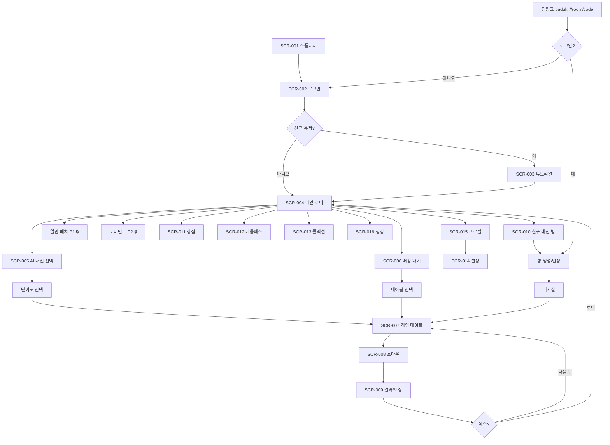

# 로우 바둑이 (Low Baduki) — S4 서비스 사이트맵

**작성일**: 2026-02-27
**프로젝트 유형**: 게임 개발 (SIGIL S4 — 개발 트랙)
**입력 문서**: S3 GDD `02-product/projects/baduki/2026-02-27-s3-gdd.md` 섹션 3 (UI/UX Flow)
**버전**: 2.0

---

## 1. 화면 계층 구조

### 1.1 전체 화면 트리

```
로우 바둑이 앱
│
├── SCR-001. 스플래시/로딩
│
├── SCR-002. 로그인
│   ├── Google OAuth
│   ├── Apple Sign-In (iOS)
│   └── 게스트 로그인
│
├── SCR-003. 튜토리얼 (신규 유저 필수)
│   ├── 1단계: 바둑이란? (족보 설명 + 퀴즈)
│   ├── 2단계: 카드 교환 (드로우 실습)
│   ├── 3단계: 베팅 (Fold/Check/Call/Raise 실습)
│   ├── 4단계: 골프 만들기 (목표 핸드 달성)
│   └── 5단계: 첫 AI 대전 (Easy AI 1판)
│
├── SCR-004. 메인 로비 ★ (중앙 허브)
│   │
│   ├── [게임 모드 — 중앙]
│   │   ├── SCR-005. AI 대전 선택
│   │   │   ├── 난이도 (Easy / Medium / Hard🔒)
│   │   │   ├── 플레이어 수 (1v1 / 1v2 / 1v3)
│   │   │   └── → SCR-007. 게임 테이블
│   │   │
│   │   ├── SCR-006. 매칭 대기 (랭크/일반)
│   │   │   ├── 테이블 선택 (연습 / 일반 / 하이롤러)
│   │   │   ├── 매칭 진행 중 (ELO 기반)
│   │   │   └── → SCR-007. 게임 테이블
│   │   │
│   │   ├── SCR-010. 친구 대전 방
│   │   │   ├── 방 만들기 (설정: 블라인드/판수/인원)
│   │   │   ├── 방 코드 입력 / 딥링크 입장
│   │   │   ├── 대기실 (플레이어 목록 + 준비)
│   │   │   └── → SCR-007. 게임 테이블
│   │   │
│   │   ├── 일반 매치 [P1 — 출시 +1개월] 🔒
│   │   │   └── → SCR-006 (매칭 대기)와 동일 플로우
│   │   │
│   │   └── 토너먼트 [P2 — 출시 +3개월] 🔒
│   │       ├── 토너먼트 로비 (8/16/32인)
│   │       ├── 대진표
│   │       └── → SCR-007. 게임 테이블
│   │
│   └── [하단 탭바 — 5개 탭]
│       ├── 탭1: 홈 (SCR-004 메인 로비)
│       ├── 탭2: 상점 (SCR-011)
│       ├── 탭3: 콜렉션 (SCR-013)
│       ├── 탭4: 랭킹 (SCR-016)
│       └── 탭5: 프로필 (SCR-015)
│
├── SCR-007. 게임 테이블 ★ (게임 플레이)
│   ├── 게임 진행 (베팅/드로우 반복)
│   ├── 이모지 팔레트 (팝업)
│   ├── 일시정지 메뉴 (팝업)
│   │   ├── 사운드 설정
│   │   ├── 족보 가이드
│   │   └── 게임 포기 (확인 다이얼로그)
│   ├── SCR-008. 쇼다운 (자동 진행)
│   └── SCR-009. 결과/보상 화면
│       ├── 승/패 표시 + 코인 손익
│       ├── ELO 변동 (랭크 매치)
│       ├── 경험치 + 레벨업
│       ├── 배틀패스 BP 진행
│       ├── 광고 시청 (패배 시만)
│       └── [다음 판] / [로비]
│
├── SCR-011. 상점
│   ├── 카드 스킨 (4종 + 번들)
│   ├── 보드 테마 (3종)
│   ├── 젬 충전 (4단계 IAP)
│   ├── 배틀패스 (시즌 패스 구매)
│   ├── VIP 구독 (월간)
│   └── 탄 상점 [FEATURE_TAN_SYSTEM ON 시만 노출]
│       ├── 엿보기 탄
│       ├── 교체 탄
│       └── 콤보 팩
│
├── SCR-012. 배틀패스
│   ├── 무료 트랙 (30단계)
│   ├── 프리미엄 트랙 (30단계) [IAP]
│   ├── 프리미엄 구매 / 레벨업 번들
│   ├── 미션 (일일/주간)
│   └── 시즌 정보 (남은 기간)
│
├── SCR-013. 콜렉션
│   ├── 카드 스킨 갤러리 (보유/미보유)
│   ├── 보드 테마 갤러리
│   ├── 이모지 목록 (6슬롯 장착)
│   └── 아바타 + 프로필 프레임
│
├── SCR-014. 설정
│   ├── 사운드 (BGM/SFX 볼륨, 진동)
│   ├── 게임 (타이머 경고)
│   ├── 계정 관리
│   │   ├── 소셜 연동 상태
│   │   ├── 게스트 → 소셜 연동
│   │   ├── 로그아웃
│   │   └── 계정 삭제 (PIPA 30일 유예)
│   ├── 지원
│   │   ├── 튜토리얼 다시 보기
│   │   └── 고객센터 (외부 링크)
│   ├── 법적 문서
│   │   ├── 이용약관
│   │   ├── 개인정보처리방침
│   │   └── 확률 공시
│   └── 앱 버전 정보
│
├── SCR-015. 프로필
│   ├── 아바타 + 프레임
│   ├── 닉네임 편집 (7일 1회, 2-12자)
│   ├── ELO / 티어 / 레벨
│   ├── 통계 (총 게임, 승률, 연승, 골프 횟수)
│   ├── 시즌/전체/친구 랭킹 순위
│   ├── 최근 매치 기록 (20판)
│   └── → SCR-014. 설정
│
└── SCR-016. 랭킹
    ├── 전체 랭킹 (Top 100 + 내 순위)
    ├── 친구 랭킹
    └── 시즌 랭킹
```

### 1.2 Mermaid 다이어그램



---

## 2. 네비게이션 흐름

### 2.1 하단 탭바 (5개 영구 탭)

| 탭 순서 | 화면 | 아이콘 | 뱃지 조건 |
|:------:|------|--------|---------|
| 1 | 메인 로비 (홈) | 홈 아이콘 | - |
| 2 | 상점 | 쇼핑백 아이콘 | 신규 아이템 등록 시 |
| 3 | 콜렉션 | 컬렉션 아이콘 | 신규 획득 아이템 시 |
| 4 | 랭킹 | 트로피 아이콘 | - |
| 5 | 프로필 | 프로필 아이콘 | - |

**탭바 표시 조건**: 로비 및 비게임 화면에서만 표시. 게임 테이블(SCR-007) 진입 시 숨김.

### 2.2 화면 전환 테이블 (전체)

| 출발 | 도착 | 트리거 | 조건 | 전환 방식 |
|------|------|--------|------|---------|
| SCR-001 스플래시 | SCR-002 로그인 | 자동 (초기화 완료) | 세션 없음 | 페이드 |
| SCR-001 스플래시 | SCR-004 로비 | 자동 (자동 로그인) | 유효 토큰 존재 | 페이드 |
| SCR-001 스플래시 | 점검 화면 | 자동 | `FEATURE_MAINTENANCE = true` | 페이드 |
| SCR-002 로그인 | SCR-003 튜토리얼 | 로그인 성공 | `tutorialCompleted == false` | 슬라이드 |
| SCR-002 로그인 | SCR-004 로비 | 로그인 성공 | `tutorialCompleted == true` | 슬라이드 |
| SCR-003 튜토리얼 | SCR-004 로비 | 5단계 완료 | - | 슬라이드 |
| SCR-004 로비 | SCR-005 AI 대전 | "AI 대전" 버튼 탭 | - | 슬라이드 |
| SCR-004 로비 | SCR-006 매칭 대기 | "랭크 매치" 버튼 탭 | 코인 ≥ 바이인 | 슬라이드 |
| SCR-004 로비 | SCR-010 친구 대전 | "친구 대전" 버튼 탭 | 로그인 (게스트 불가) | 슬라이드 |
| SCR-004 로비 | SCR-011 상점 | 탭바 "상점" | - | 탭 전환 |
| SCR-004 로비 | SCR-012 배틀패스 | 시즌 패스 바 탭 | - | 슬라이드 |
| SCR-004 로비 | SCR-013 콜렉션 | 탭바 "콜렉션" | - | 탭 전환 |
| SCR-004 로비 | SCR-015 프로필 | 탭바 "프로필" | - | 탭 전환 |
| SCR-004 로비 | SCR-016 랭킹 | 탭바 "랭킹" | - | 탭 전환 |
| SCR-005 AI 대전 | SCR-007 게임 테이블 | 난이도 선택 | - | 전체 전환 |
| SCR-005 AI 대전 | SCR-004 로비 | 뒤로가기 | - | 슬라이드 백 |
| SCR-006 매칭 대기 | SCR-007 게임 테이블 | 매칭 성공 | - | 전체 전환 |
| SCR-006 매칭 대기 | SCR-004 로비 | 취소 버튼 | - | 슬라이드 백 |
| SCR-007 게임 테이블 | SCR-008 쇼다운 | 4라운드 베팅 완료 | 남은 플레이어 ≥ 2 | 인라인 전환 |
| SCR-007 게임 테이블 | SCR-009 결과 | 단독 생존 | 전원 Fold | 인라인 전환 |
| SCR-008 쇼다운 | SCR-009 결과 | 자동 (3-5초) | - | 인라인 전환 |
| SCR-009 결과 | SCR-007 게임 테이블 | "다음 판" 버튼 | 같은 모드 재매칭 | 전체 전환 |
| SCR-009 결과 | SCR-004 로비 | "로비" 버튼 OR 10초 자동 | - | 전체 전환 |
| SCR-010 친구 대전 | SCR-007 게임 테이블 | 방장 "게임 시작" | 2인 이상 | 전체 전환 |
| SCR-010 친구 대전 | SCR-004 로비 | 뒤로가기 | - | 슬라이드 백 |
| SCR-011 상점 | 스토어 결제 UI | "구매" 확인 | 한도 내 | 오버레이 |
| SCR-015 프로필 | SCR-014 설정 | "설정" 버튼 | - | 슬라이드 |
| SCR-015 프로필 | SCR-013 콜렉션 | "아바타 변경" | - | 탭 전환 |
| 외부 (딥링크) | SCR-010 친구 대전 | `baduki://room/{code}` | 유효 방 코드 + 로그인 | 직접 진입 |

### 2.3 뒤로가기 동작 규칙

| 현재 화면 | 뒤로가기 동작 | 비고 |
|---------|------------|------|
| 메인 로비 | 앱 종료 확인 다이얼로그 | 2회 연속 시 종료 |
| 게임 테이블 (진행 중) | 게임 포기 확인 팝업 | ELO 패널티 경고 (랭크) |
| 게임 테이블 (AI 대전) | 게임 포기 확인 팝업 | 패널티 없음 |
| 결과 화면 | → 메인 로비 | 동일 |
| 상점/콜렉션/랭킹/프로필 | → 이전 탭 or 메인 로비 | 탭 히스토리 기반 |
| 설정 | → 프로필 | 슬라이드 백 |
| 튜토리얼 | 차단 (건너뛰기 불가) | 뒤로가기 무시 |
| 팝업 (이모지/메뉴) | 팝업 닫기 | 아래 화면 유지 |

### 2.4 핵심 유저 플로우 (탭 수)

| 플로우 | 경로 | 탭 수 |
|--------|------|:----:|
| 앱 실행 → AI 대전 시작 | 로비 → AI 대전 → 난이도 선택 | **2탭** |
| 앱 실행 → 랭크 매치 | 로비 → 랭크 매치 → (자동 매칭) | **1탭** |
| 앱 실행 → 상점 구매 | 로비 → 상점 탭 → 아이템 선택 | **2탭** |
| 게임 종료 → 다음 판 | 결과 → "다음 판" | **1탭** |
| 친구 초대 수락 | 딥링크 → (로그인) → 대기실 | **0-1탭** |
| 코스메틱 장착 | 로비 → 콜렉션 탭 → 아이템 → 장착 | **3탭** |

---

## 3. 딥링크 (Deep Link)

### 3.1 딥링크 스키마

| 딥링크 URL | 대상 화면 | 파라미터 | 동작 |
|-----------|---------|---------|------|
| `baduki://room/{roomCode}` | SCR-010 친구 대전 방 | roomCode: 8자리 영숫자 | 방 자동 입장 |
| `baduki://profile/{userId}` | SCR-015 프로필 (타인) | userId: Firebase UID | 해당 유저 프로필 표시 |
| `baduki://shop/{productId}` | SCR-011 상점 | productId: 상품 ID | 해당 상품으로 스크롤 |
| `baduki://battlepass` | SCR-012 배틀패스 | - | 배틀패스 화면 직접 진입 |

### 3.2 딥링크 처리 플로우

```
딥링크 수신
  │
  ├── 앱 미설치 → 스토어로 리다이렉트 (Deferred Deep Link)
  │
  ├── 앱 설치 + 미로그인
  │   └── 로그인 화면 → 로그인 완료 후 딥링크 목적지로 이동
  │
  └── 앱 설치 + 로그인 완료
      └── 즉시 딥링크 목적지로 이동
```

### 3.3 Universal Link / App Link 설정

| 플랫폼 | 설정 |
|--------|------|
| Android | `AndroidManifest.xml` → intent-filter: `baduki://`, `https://baduki.app/` |
| iOS | `Associated Domains` → `applinks:baduki.app` |

**웹 폴백**: `https://baduki.app/room/{roomCode}` → 앱 미설치 시 스토어 안내 페이지

---

## 4. 접근 권한 매트릭스

### 4.1 계정 유형별 접근 권한

| 화면 / 기능 | 비로그인 (게스트) | 일반 유저 | VIP 유저 |
|------------|:-------------:|:-------:|:------:|
| AI 대전 (Easy/Medium) | O | O | O |
| AI 대전 (Hard) | X (로그인+30일) | 조건부 | 조건부 |
| 랭크 매치 | X | O | O |
| 친구 대전 | X | O | O |
| 일반 매치 (P1) | X | O (해금 후) | O |
| 토너먼트 (P2) | X | O (해금 후) | O |
| 상점 (IAP 구매) | X | O | O |
| 배틀패스 무료 트랙 | X | O | O |
| 배틀패스 프리미엄 트랙 | X | 구매 시 | 구매 시 |
| VIP 전용 이모지 | X | X | O |
| 광고 제거 | X | X | O |
| 친구 추가 | X | O | O |
| 랭킹 표시 | X | O | O |
| 게스트 → 소셜 연동 | 연동 버튼 | - | - |

### 4.2 오프라인 모드 접근 권한

| 화면 / 기능 | 온라인 | 오프라인 |
|------------|:-----:|:------:|
| AI 대전 (전 난이도) | O | O |
| 랭크/일반/친구 매치 | O | X |
| 상점 구매 | O | X |
| 배틀패스 | O | X (오프라인 BP 로컬 저장 → 온라인 시 동기화) |
| 콜렉션 (보유 아이템 조회) | O | O (캐시) |
| 랭킹 | O | X |
| 설정 (로컬 설정) | O | O |

---

## 5. 화면 수 요약

| 우선순위 | 화면 수 | 포함 화면 |
|---------|:------:|---------|
| **P0 (출시 필수)** | 16개 | 스플래시, 로그인, 튜토리얼, 로비, AI 대전 선택, 매칭 대기, 게임 테이블, 쇼다운, 결과, 친구 대전 방, 상점, 배틀패스, 콜렉션, 설정, 프로필, 랭킹 |
| **P1 (출시 +1개월)** | 2개 | 일반 매치 (기존 매칭 플로우 재사용), 탄 상점 (FEATURE_TAN_SYSTEM ON 시) |
| **P2 (출시 +3개월)** | 3개 | 토너먼트 로비, 대진표, 클럽 시스템 |
| **총합** | **21개** | |

**팝업/오버레이 (별도 화면 미계수)**: 일일 접속 보너스, 레벨업, 이벤트 공지, 이모지 팔레트, 게임 메뉴, 구매 확인, 에러 다이얼로그, 게임 포기 확인, 닉네임 변경, 계정 삭제 확인 (약 10종)

---

## 변경 이력

| 버전 | 날짜 | 변경 내용 | 작성자 |
|------|------|---------|--------|
| 1.0 | 2026-02-27 | 초안 (화면 트리 + 기본 네비게이션) | Claude Sonnet 4.6 |
| 2.0 | 2026-02-27 | 전면 보강 — Mermaid 다이어그램, 전환 테이블 30+항목, 딥링크 4종, 접근 권한, 오프라인 모드 | Claude Opus 4.6 |

---

**다음 문서**: 관리자 상세 기획서 (`2026-02-27-s4-admin-detailed-plan.md`)
