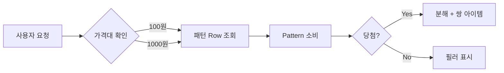

# S3 기획서

## S3. Design Document (기획서)

| 유형 | 에이전트/커맨드 | 산출물 |
|------|---------------|--------|
| 앱/웹 | `/prd` 커맨드 | PRD (.md + **.pptx 필수**) |
| 게임 | gdd-writer 에이전트 | GDD (.md + **.pptx 필수**) |

- **에이전트 회의**: Competing Hypotheses — 기획 에이전트 2~3명 독립 초안 → 최적안 선택/병합
- **필수 방법론** (유형별):

| 유형 | 필수 방법론 |
|------|-----------|
| 앱/웹 | Shape Up Pitch + User Story Mapping + Modern PRD |
| 게임 | GDD 10섹션 완성 + Core Loop 검증 + 밸런싱 수치 테이블 + 에이전트 회의 |

- **선택 방법론**: Outcome-based Roadmap, Event Storming
- **플러그인 보강** (선택적):
  - `product-management:stakeholder-comms` — PRD 승인 후 이해관계자 업데이트 생성
  - `marketing:competitive-analysis` — 배틀카드 생성 기능 보조
- **PPT 변환 필수**: S3 기획서 .md 완성 후 `/pptx` 스킬로 .pptx 생성 필수
- **게이트**: **[STOP]** 기획서 승인 (PPT 포함)

## 기획서 구조 원칙

**피라미드 원칙 (McKinsey)**: 기획서(.md)와 PPT 모두 **결론 먼저, 근거 나중** 구조를 따른다. 각 섹션의 첫 문장이 핵심 주장이고, 이하 내용이 근거를 뒷받침한다. 읽는 사람이 첫 페이지만 읽어도 전체 방향을 파악할 수 있어야 한다.

**PPT 서사 구조 (Duarte)**: PPT 슬라이드 흐름은 "현재 상태(문제) → 미래 상태(해결)" 긴장-해소 반복 구조로 설계한다.
- 슬라이드 1-2: 현재 문제/기회 (What Is)
- 슬라이드 3-N: 해결 방안 + 근거 (What Could Be)
- 마지막: 실행 계획/결론 (Call to Action)

---

## 시각 자료 필수 포함 규칙

기획서(.md)와 PPT 모두에 시각 자료를 풍부하게 포함한다. 텍스트만으로 구성된 기획서는 이해도와 전달력이 50% 이하로 떨어진다.

### 필수 시각 자료 (최소 기준)

| 유형 | 필수 항목 | 도구 |
|------|----------|------|
| **플로우 다이어그램** | 핵심 사용자 플로우, 데이터 흐름, 상태 전이 | Mermaid (.md), PptxGenJS 도형 (.pptx) |
| **비교 차트/그래프** | 경쟁사 비교, 시장 데이터, 수치 분석 | PptxGenJS Charts (BAR, PIE, LINE) |
| **구조 다이어그램** | 시스템 구조, 모듈 관계, 기능 계층 | Mermaid (.md), 도형 조합 (.pptx) |
| **테이블/매트릭스** | 기능 비교표, 우선순위 매트릭스, 스코어링 | Markdown 테이블 (.md), PptxGenJS Table (.pptx) |
| **일러스트/이미지** | 컨셉 비주얼, 테마 이미지 | NanoBanana MCP (AI 생성) |
| **UI 목업/화면 설계** | 핵심 화면 목업, 레이아웃 탐색, UI 변형 비교 | Stitch MCP (AI UI 생성) |

### 슬라이드별 시각 가이드 (PPT)

| 슬라이드 유형 | 권장 시각 요소 |
|-------------|--------------|
| 타이틀 | NanoBanana 배경 이미지 + 컨셉 일러스트 |
| 시스템 개요 | 비교 테이블 + 핵심 차별점 다이어그램 |
| 플로우/프로세스 | 단계별 카드 + 화살표 플로우 |
| 데이터/수치 | BAR/PIE 차트 + 대형 스탯 콜아웃 |
| 구조/아키텍처 | 박스-화살표 다이어그램 + 레이어 도형 |
| 경제/비즈니스 | 데이터 테이블 + 그래프 조합 |
| 의사결정 요약 | 그리드 카드 레이아웃 |

### UI 목업 생성 with Stitch

앱/웹 프로젝트에서 핵심 화면의 UI 목업을 Stitch MCP로 생성한다.

**활용 시점:**
- S3 기획서에 핵심 화면 목업을 포함할 때
- 에이전트 회의에서 UI 안을 비교할 때 (generate_variants로 변형 생성)
- PPT에 삽입할 화면 레이아웃 참조가 필요할 때

**워크플로:**
1. `create_project` — SIGIL 프로젝트용 Stitch 프로젝트 생성
2. `generate_screen_from_text` — 핵심 화면별 목업 생성 (Desktop/Mobile)
3. `generate_variants` — 레이아웃/컬러 변형 2-3개 생성하여 비교
4. 최종 선택한 목업을 기획서(.md)에 참조, PPT에 스크린샷 삽입

**프로젝트 유형별 적용:**

| 유형 | Stitch 활용 | 예시 |
|------|:----------:|------|
| 앱/웹 | **필수** | 메인 화면, 대시보드, 핵심 플로우 화면 |
| 게임 (Unity) | 선택 | 관리자 웹 UI, 로비/상점 UI 컨셉 |

**Stitch + 에이전트 회의 연계:**
- 에이전트 A/B/C 각각의 UI 안을 Stitch로 생성 → `generate_variants`로 변형 → 비교표에 포함

### .md 기획서 시각 자료

Markdown 기획서에는 아래를 포함한다:

- **Mermaid 다이어그램**: 플로우차트, 시퀀스, 상태 전이, ER 다이어그램
- **테이블**: 비교표, 수치 데이터, 매트릭스
- **ASCII 다이어그램**: 간단한 구조도 (Mermaid가 과할 때)
- **NanoBanana 이미지 임베딩**: 컨셉 일러스트, UI 목업 (이미지 생성 후 상대경로로 삽입)

```markdown
<!-- Mermaid 예시 -->


<!-- NanoBanana 이미지 예시 -->

```

## Do

- S3 기획서는 **.md + .pptx** 모두 생성한다
- 기획 에이전트 2~3명의 독립 초안을 Competing Hypotheses로 비교한다
- 필수 방법론(Shape Up Pitch, User Story Mapping, Modern PRD)을 적용한다
- .md 기획서에 Mermaid 다이어그램, 비교 테이블, 수치 그래프를 포함한다
- .pptx에 NanoBanana 배경/일러스트, 차트(BAR/PIE/LINE), 플로우 다이어그램을 포함한다
- 수치 데이터(시장 규모, 확률, 경제 설계 등)는 반드시 차트/그래프로 시각화한다
- 앱/웹 프로젝트는 Stitch로 핵심 화면 UI 목업을 생성하여 기획서에 포함한다

## Don't

- .pptx 없이 기획서 승인을 진행하지 않는다
- 단일 에이전트 초안만으로 기획서를 확정하지 않는다 (에이전트 회의 필수)
- [STOP] 게이트 없이 S4로 진행하지 않는다
- 텍스트와 테이블만으로 구성된 기획서를 완성으로 간주하지 않는다 (다이어그램/차트 필수)
- PPT 슬라이드를 텍스트+불릿으로만 채우지 않는다 (매 슬라이드에 시각 요소 필수)

## AI 행동 규칙

1. 에이전트 회의 결과는 비교표 + 선택 근거를 명시한다
2. S3 기획서는 **.md + .pptx** 모두 생성한다
3. 각 Stage 산출물은 해당 폴더의 `projects/{project}/` 하위에 저장한다
4. 프로젝트 폴더 내 파일명에서 프로젝트명을 제거한다 (폴더가 이미 프로젝트를 나타냄)
5. S3 산출물(PRD/GDD)에 "에이전트 회의 결과" 섹션을 필수 포함한다
5-1. PRD/GDD에 **"도메인 용어 정의(Glossary)"** 섹션을 필수 포함한다 — 한국어(기획 용어)↔영어(코드명)↔정의↔관계 4열 테이블
6. 수치 데이터는 차트/그래프로, 프로세스는 다이어그램으로, 구조는 도형으로 시각화한다
7. NanoBanana로 PPT 배경 이미지와 컨셉 일러스트를 생성한다
8. 앱/웹 프로젝트는 Stitch로 핵심 화면 UI 목업을 생성하고, generate_variants로 UI 안을 비교한다

## Iron Laws

- **IRON-1**: 단일 에이전트 초안만으로 기획서를 확정하지 않는다 (에이전트 회의 필수)
- **IRON-2**: .pptx 없이 기획서 승인을 진행하지 않는다

## Rationalization Table

| 합리화 (Thought) | 현실 (Reality) |
|-------------------|---------------|
| "시간이 부족하니 에이전트 회의 없이 진행하자" | 단일 관점 기획은 30-50% 품질 저하를 유발한다. Competing Hypotheses 비교에 소요되는 시간이 재작업 비용보다 훨씬 적다 |
| "PPT는 나중에 만들어도 된다" | [STOP] Gate는 .md + .pptx 모두를 요구한다. PPT 없는 기획서는 이해관계자 커뮤니케이션에서 실패한다 |
| "텍스트로 충분히 설명했으니 다이어그램은 필요 없다" | 텍스트 기획서의 이해도는 시각 자료 포함 대비 50% 이하. 플로우, 구조, 수치는 반드시 시각화한다 |
| "이미지 생성에 시간이 너무 든다" | NanoBanana 1장 생성에 10-20초. 3-5장이면 1-2분. 기획서 전달력 대비 투자 가치가 크다 |

## Red Flags

- "한 명이 잘 작성했으니 비교 안 해도..." → STOP. 에이전트 회의를 실행한다
- "PPT는 형식적이니까..." → STOP. /pptx 스킬로 PPT를 생성한다
- "글로 다 설명했으니 그림은..." → STOP. 다이어그램/차트/일러스트를 추가한다
- "시각 자료는 S4에서..." → STOP. S3 기획서 자체에 시각 자료가 필수다
