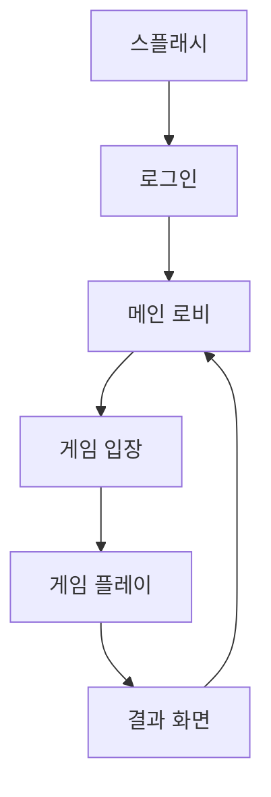

# {게임명} — Game Design Document (GDD)

**작성일**: YYYY-MM-DD
**버전**: 1.0
**프로젝트 유형**: 게임 개발 (SIGIL S3)
**엔진**: {엔진명}
**플랫폼**: {타겟 플랫폼}

---

## 1. Game Overview (게임 개요)

### 1.1 High Concept
> 1문장으로 게임 핵심을 설명

### 1.2 핵심 재미 요소 (Core Fantasy)
- 플레이어가 느끼는 감정/판타지

### 1.3 장르 & 서브장르

### 1.4 타겟 유저
| 세그먼트 | 연령 | 동기 | 예상 비중 |
|---------|------|------|---------|

### 1.5 USP (Unique Selling Point)
- 경쟁사 대비 명확한 차별점 3가지

---

## 2. Core Mechanics (핵심 메커닉)

### 2.1 코어 루프 (Core Loop)
```
{메인 루프 다이어그램}
```

### 2.2 게임 규칙
| 규칙 | 설명 |
|------|------|

### 2.3 플레이어 액션
| 액션 | 입력 | 결과 | 피드백 |
|------|------|------|--------|

### 2.4 승리/패배 조건

### 2.5 Luck vs Skill 비율
- Luck: __% / Skill: __%
- 근거:

---

## 3. UI/UX Flow (화면 플로우)

### 3.1 전체 화면 맵


### 3.2 주요 화면별 상세

#### 화면: {화면명}
- **진입 조건**:
- **화면 요소**:
- **유저 액션**:
- **이탈 경로**:

(화면별 반복)

### 3.3 네비게이션 패턴
- 뒤로가기 동작:
- 딥링크 지원:

---

## 4. Art Direction (아트 방향)

### 4.1 시각 스타일
- 스타일:
- 참고 게임/이미지:

### 4.2 컬러 팔레트
| 용도 | 색상 | HEX |
|------|------|-----|

### 4.3 에셋 가이드
| 에셋 유형 | 사양 | 수량 |
|----------|------|------|

### 4.4 애니메이션 가이드
| 애니메이션 | 트리거 | 지속시간 | 이징 |
|-----------|--------|---------|------|

---

## 5. Audio Design (오디오 설계)

### 5.1 BGM 방향
| 장면 | 분위기 | 참고곡 |
|------|--------|--------|

### 5.2 SFX 목록
| 이벤트 | 효과음 설명 | 우선순위 |
|--------|-----------|---------|

### 5.3 음성/내레이션
- 해당 여부:
- 방향:

---

## 6. Economy Design (경제 설계)

### 6.1 통화 시스템
| 통화 | 획득 방법 | 사용처 | 싱크 |
|------|---------|--------|------|

### 6.2 수익화 모델
| 수익원 | 비중 | 설명 |
|--------|:---:|------|

### 6.3 인앱 구매 항목
| 상품 | 가격 | 가치 | 카테고리 |
|------|------|------|---------|

### 6.4 LTV/ARPU 목표
| 지표 | 목표값 | 근거 |
|------|--------|------|

### 6.5 밸런싱 수치 테이블
(게임별 커스텀)

---

## 7. Level/Content Design (콘텐츠 설계)

### 7.1 콘텐츠 구조
| 콘텐츠 | 수량 | 해금 조건 |
|--------|------|---------|

### 7.2 난이도 곡선

### 7.3 시즌/이벤트 계획
| 시즌 | 기간 | 테마 | 보상 |
|------|------|------|------|

### 7.4 사회적 기능 (소셜)
- 친구 시스템:
- 클럽/길드:
- 채팅:
- 리더보드:

---

## 8. Technical Constraints (기술 요구사항)

### 8.1 엔진 & 프레임워크

### 8.2 최소/권장 사양
| 항목 | 최소 | 권장 |
|------|------|------|

### 8.3 네트워크 아키텍처
- 모델: (Server-Authoritative / P2P / Hybrid)
- 프로토콜:
- 동기화 빈도:

### 8.4 서버/백엔드

### 8.5 AI 시스템
| 난이도 | 방식 | 응답시간 |
|--------|------|---------|

### 8.6 제3자 서비스
| 서비스 | 용도 | 비용 |
|--------|------|------|

---

## 9. 리스크 & 완화 전략

| 리스크 | 심각도 | 완화 전략 |
|--------|:-----:|---------|

## 10. 법률/심의

### 10.1 등급 심의
### 10.2 규제 준수 항목
### 10.3 개인정보보호

---

## 에이전트 회의 결과

> `agent-meeting-template.md` 참조. 기획서 최상단에 배치하여 검토자가 의사결정 과정을 확인할 수 있게 한다.

---

## 부록

### A. 참고 게임 분석
### B. 도메인 용어 정의 (Glossary)

> 기획서 전체에서 사용하는 핵심 개념을 정의한다. 기획↔개발 간 용어 불일치 방지 목적.
> 이 테이블이 Trine Spec 작성 시 한국어↔영어 코드명 기준이 된다.

| 한국어 (기획 용어) | 영어 (코드명) | 정의 | 관계 |
|-----------------|------------|------|------|
| {예시: 게임 방} | {GameRoom} | {2~4명이 참여하는 단일 게임 세션} | {Lobby에서 생성됨} |
| {예시: 로비} | {Lobby} | {매칭 대기 공간} | {GameRoom을 생성함} |
| (프로젝트별 추가) | | | |
### C. 변경 이력

| 버전 | 날짜 | 변경 내용 |
|------|------|---------|
| 1.0 | YYYY-MM-DD | 초안 작성 |
