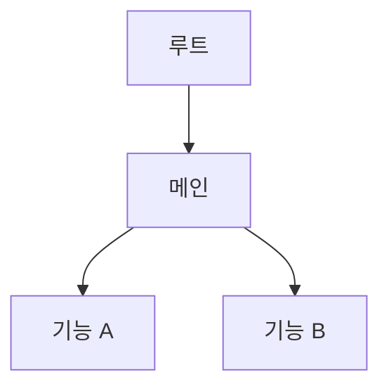

# {프로젝트명} — S4 기획 패키지

**작성일**: YYYY-MM-DD
**프로젝트 유형**: {앱/웹/게임} (SIGIL S4 — 개발 트랙)
**입력 문서**: S3 기획서 `02-product/projects/{project}/YYYY-MM-DD-s3-{prd|gdd}.md`

---

> S4 기획 패키지는 7대 산출물로 구성된다.
> 각 산출물은 별도 파일로 작성하되, 이 문서가 인덱스 역할을 한다.
> 관리자 페이지가 포함된 프로젝트는 서비스+관리자 산출물을 모두 작성한다.

## 산출물 인덱스

### 서비스 산출물

| # | 산출물 | 파일 경로 | 상태 |
|:-:|--------|---------|:----:|
| 1 | 상세 기획서 | `02-product/projects/{project}/YYYY-MM-DD-s4-detailed-plan.md` | ⬜ |
| 2 | 사이트맵 | `02-product/projects/{project}/YYYY-MM-DD-s4-sitemap.md` | ⬜ |
| 3 | 로드맵 | `02-product/projects/{project}/YYYY-MM-DD-s4-roadmap.md` | ⬜ |
| 4 | 상세 개발 계획 | `02-product/projects/{project}/YYYY-MM-DD-s4-development-plan.md` | ⬜ |
| 5 | WBS | `02-product/projects/{project}/YYYY-MM-DD-s4-wbs.md` | ⬜ |
| 6 | UI/UX 기획서 | `05-design/projects/{project}/YYYY-MM-DD-s4-uiux-spec.md` | ⬜ |
| 7 | 테스트 전략서 | `02-product/projects/{project}/YYYY-MM-DD-s4-test-strategy.md` | ⬜ |

### 관리자 산출물 (해당 시)

| # | 산출물 | 파일 경로 | 상태 |
|:-:|--------|---------|:----:|
| 8 | 관리자 상세 기획서 | `02-product/projects/{project}/YYYY-MM-DD-s4-admin-detailed-plan.md` | ⬜ |
| 9 | 관리자 사이트맵 | `02-product/projects/{project}/YYYY-MM-DD-s4-admin-sitemap.md` | ⬜ |
| 10 | 관리자 UI/UX 기획서 | `05-design/projects/{project}/YYYY-MM-DD-s4-admin-uiux-spec.md` | ⬜ |

> 로드맵(#3), 개발 계획(#4), WBS(#5), 테스트 전략서(#7)는 서비스+관리자 통합 문서로 작성한다.

---

## 1. 상세 기획서

> S3 기획서(PRD/GDD)를 **구현 관점**에서 상세화한다.

### 1.1 화면별 동작 명세
| 화면 | 유저 액션 | 시스템 반응 | 데이터 변경 |
|------|---------|-----------|-----------|

### 1.2 데이터 흐름
```
{데이터 흐름 다이어그램}
```

### 1.3 비즈니스 로직 상세
| 기능 | 입력 | 처리 | 출력 | 예외 |
|------|------|------|------|------|

### 1.4 API 엔드포인트 (웹/앱)
| Method | Path | 설명 | Request | Response |
|--------|------|------|---------|----------|

---

## 2. 사이트맵

> 페이지/화면 계층 구조 + 네비게이션 흐름

### 2.1 계층 구조


### 2.2 네비게이션 흐름
| 출발 | 도착 | 트리거 | 조건 |
|------|------|--------|------|

### 2.3 접근 권한
| 화면 | 비로그인 | 일반 | 관리자 |
|------|:------:|:---:|:-----:|

---

## 3. 로드맵

> Now/Next/Later + RICE/ICE 우선순위 (서비스+관리자 통합)

### 3.1 Now (1-2개월)
| 기능 | 대상 | RICE Score | 설명 |
|------|:----:|:---------:|------|

### 3.2 Next (3-4개월)
| 기능 | 대상 | RICE Score | 설명 |
|------|:----:|:---------:|------|

### 3.3 Later (5개월+)
| 기능 | 대상 | RICE Score | 설명 |
|------|:----:|:---------:|------|

> **대상**: 서비스 / 관리자 / 공통

### 3.4 마일스톤
| 마일스톤 | 기간 | 핵심 산출물 | 성공 기준 |
|---------|------|-----------|---------|

---

## 4. 상세 개발 계획

> 기술 스택, 아키텍처, 개발 환경, ADR + **Trine 세션 로드맵**

### 4.1 기술 스택
| 레이어 | 기술 | 버전 | 선택 근거 |
|--------|------|------|---------|

### 4.2 아키텍처 (C4 Model)

#### Context Diagram
```
{시스템 컨텍스트}
```

#### Container Diagram
```
{컨테이너 구성}
```

#### Component Diagram
```
{주요 컴포넌트}
```

### 4.3 개발 환경
| 도구 | 용도 | 설정 |
|------|------|------|

### 4.4 ADR (Architecture Decision Records)

#### ADR-001: {결정 제목}
- **Status**: Accepted
- **Context**: {배경}
- **Decision**: {결정}
- **Consequences**: {결과}

### 4.5 Trine 세션 로드맵

> 각 Trine 세션의 범위, 분류, 산출물 문서명을 명시한다.
> 문서명은 프로젝트 네이밍 규칙을 따른다.

#### Session 1: {기능명} (예: 인증 시스템)
- **범위**: {이 세션에서 구현할 기능}
- **분류**: {Hotfix / Small / Standard / Multi-Spec}
- **산출물**:
  - Spec: `.specify/specs/{project}-{feature}-spec.md`
  - Plan: `.specify/plans/{project}-{feature}-plan.md`
  - Task: `.specify/plans/{project}-{feature}-task.md` (Multi-Spec인 경우)
- **Todo**:
  - [ ] Spec 작성 (FR/NFR 정의)
  - [ ] Plan 작성 (구현 전략)
  - [ ] Task 분배 (에이전트별 작업, Multi-Spec인 경우)
  - [ ] 구현 + AI Check 3 통과
  - [ ] Walkthrough 작성
  - [ ] PR 생성

#### Session 2: {기능명} (예: 게임 로비)
- **범위**: {이 세션에서 구현할 기능}
- **분류**: {Hotfix / Small / Standard / Multi-Spec}
- **산출물**: (위와 동일 구조)
- **Todo**: (위와 동일 구조)

#### Session N: 관리자 페이지 (해당 시)
- **범위**: 관리자 대시보드, 유저 관리, 콘텐츠 관리, 통계
- **분류**: Standard 또는 Multi-Spec
- **산출물**:
  - Spec: `.specify/specs/{project}-admin-spec.md`
  - Plan: `.specify/plans/{project}-admin-plan.md`
  - Task: `.specify/plans/{project}-admin-task.md`
- **Todo**: (위와 동일 구조)

> **세션 순서**: 로드맵의 우선순위에 따라 배치. 관리자 우선순위가 높으면 초기 세션에 배치.

---

## 5. WBS (Work Breakdown Structure)

> 에픽 → 스토리 → 태스크 계층 분해 (서비스+관리자 통합)

### 5.1 에픽 목록
| 에픽 | 대상 | 스토리 수 | 총 SP | 우선순위 |
|------|:----:|:-------:|:----:|:------:|

> **대상**: 서비스 / 관리자 / 공통

### 5.2 스토리 상세

#### 에픽 1: {에픽명}

| ID | 스토리 | AC (Acceptance Criteria) | SP | 의존성 |
|----|--------|------------------------|----|--------|

#### 에픽 2: {에픽명}
(반복)

### 5.3 스프린트 배치 (제안)
| 스프린트 | 기간 | 스토리 | SP 합계 |
|---------|------|--------|:------:|

---

## 6. UI/UX 기획서

> 별도 파일 `05-design/projects/{project}/YYYY-MM-DD-s4-uiux-spec.md` 참조
> 구조는 `09-tools/templates/uiux-spec-template.md` 참조
> **모바일 와이어프레임 필수 포함** — 주요 화면에 데스크톱+모바일 와이어프레임을 모두 작성한다

---

## 7. 테스트 전략서

> 프로젝트 전역 테스트 방침. 개별 Spec의 테스트 섹션은 이 전략서를 기반으로 작성한다.

### 7.1 테스트 계층 및 비율

| 계층 | 비율 목표 | 실행 시점 | 도구 |
|------|:-------:|---------|------|
| 단위 테스트 | | 매 커밋 (pre-push) | |
| 통합 테스트 (API) | | 매 커밋 (CI) | |
| E2E 테스트 | | staging 배포 후 | |
| 모바일 디바이스 E2E | | staging 배포 후 | Playwright devices (iPhone, Pixel) |

### 7.2 프론트엔드 테스트 전략

| 대상 | 테스트 방식 | 도구 | 예시 |
|------|-----------|------|------|
| UI 컴포넌트 | 단위 | | 렌더링 + 사용자 이벤트 |
| 커스텀 훅 | 단위 | | 상태 변화 + 반환값 |
| API 모킹 | 통합 | | 네트워크 요청 가로채기 |
| 접근성 | 자동 | | ARIA 규칙 위반 탐지 |
| 반응형/모바일 렌더링 | 단위/통합 | | `matchMedia` 모킹으로 breakpoint별 컴포넌트 검증 |
| 비주얼 리그레션 | 선택 | | 스크린샷 비교 (데스크톱 + 모바일 뷰포트) |

### 7.3 백엔드 테스트 전략

| 대상 | 테스트 방식 | 도구 | 예시 |
|------|-----------|------|------|
| Service 비즈니스 로직 | 단위 | | 입력/출력/예외 |
| API 엔드포인트 | 통합 | | HTTP 요청/응답/상태코드 |
| Guard/Interceptor | 단위 | | 인증/인가 시나리오 |
| DB 연동 | 통합 | | CRUD + 트랜잭션 |

### 7.4 테스트 데이터 시딩 전략

| 항목 | 전략 |
|------|------|
| 테스트 DB | |
| 시딩 방식 | |
| Factory 패턴 | |
| 테스트 격리 | |
| 정리(Cleanup) | |

### 7.5 테스트 환경 설정

| 환경 | 파일/설정 | 용도 |
|------|---------|------|
| 환경변수 | `.env.test` | 테스트 전용 DB/API |
| Jest 설정 | | 모듈 매핑, 타임아웃 |
| CI 설정 | | 테스트 실행 파이프라인 |

### 7.6 커버리지 목표

| 영역 | 목표 | 측정 도구 |
|------|:----:|---------|
| 전체 | | |
| 핵심 비즈니스 로직 | | |
| API 엔드포인트 | | |

---

## 8. 관리자 UI/UX 기획서 (해당 시)

> 별도 파일 `05-design/projects/{project}/YYYY-MM-DD-s4-admin-uiux-spec.md` 참조

### 관리자 UI/UX 필수 내용
- 디자인 원칙 + 디자인 토큰 (서비스와 공유 or 별도)
- 관리자 대시보드 와이어프레임
- 관리자 전용 컴포넌트 스펙 (데이터 테이블, 차트, 필터, 권한 UI 등)
- 관리자 인터랙션 패턴 (벌크 액션, 검색/정렬, CRUD 흐름)
- 관리자/운영툴 반응형 설계 (Mobile-first 기본, Desktop-only 페이지 명시적 선언)

---

## 9. 기술 품질 기준 (개발 트랙)

### 9.1 성능 목표
| 지표 | 목표값 | 측정 도구 |
|------|:------:|---------|
| LCP (Largest Contentful Paint) | < 2.5s | Lighthouse / Web Vitals |
| FID (First Input Delay) | < 100ms | Lighthouse / Web Vitals |
| CLS (Cumulative Layout Shift) | < 0.1 | Lighthouse / Web Vitals |
| TTFB (Time to First Byte) | < 800ms | Lighthouse |
| INP (Interaction to Next Paint) | < 200ms | Web Vitals |

### 9.2 번들 사이즈 예산
| 대상 | 예산 | 비고 |
|------|:----:|------|
| 초기 로드 JS | {목표값} | First Load 기준 |
| 개별 라우트 JS | {목표값} | 라우트별 상한 |
| CSS 합계 | {목표값} | 전체 스타일시트 |
| 이미지 (LCP 요소) | {목표값} | 최적화 필수 |

### 9.3 아키텍처 품질 원칙
| 원칙 | 설명 | 기획 수준 기준 |
|------|------|:-------------:|
| Server-First | RSC 기본, 클라이언트 최소화 | "use client" 사용 화면 목록 명시 |
| Waterfall 제거 | 독립 데이터 소스 병렬 fetch | 데이터 의존 관계도에서 병렬 가능 항목 식별 |
| 번들 최적화 | dynamic import, tree shaking | 대형 라이브러리 사용 시 번들 영향도 명시 |
| 접근성 | WCAG 2.1 AA 준수 | 접근성 필수 화면/컴포넌트 목록 명시 |

### 9.4 SIGIL ↔ Trine 역할 분리

> 이 섹션은 **기획 수준 기준**(목표 설정)만 포함한다.
> **구현 검증 기준**(코드가 룰을 따르는지 Check)은 Trine 영역이다.

| 항목 | SIGIL S4 (기획 기준) | Trine Check (검증 기준) |
|------|---------------------|----------------------|
| 성능 | "LCP < 2.5s 달성" (목표 설정) | "async-parallel 룰 준수 여부 코드 검사" |
| 번들 | "초기 JS < 200KB 예산" (예산 설정) | "barrel import 사용 여부, dynamic import 적용 검사" |
| 아키텍처 | "RSC 우선, 클라이언트 최소화" (방향 설정) | "use client 개수, server action 인증 패턴 검사" |
| 접근성 | "WCAG 2.1 AA 준수" (기준 설정) | "aria-label, focus trap, 키보드 탐색 코드 검사" |

---

## 검증 체크리스트 (S4 DoD)

- [ ] 상세 기획서 완성 (화면별 동작, 데이터 흐름)
- [ ] 사이트맵 완성 (계층 구조 + 네비게이션)
- [ ] 로드맵 완성 (Now/Next/Later + RICE 우선순위)
- [ ] 상세 개발 계획 완성 (기술 스택, C4 아키텍처, ADR)
- [ ] **Trine 세션 로드맵 완성** (세션별 범위 + Spec/Plan/Task 문서명)
- [ ] WBS 완성 (Story Point 기반 작업 분해)
- [ ] UI/UX 기획서 완성 (와이어프레임 + 컴포넌트 스펙)
- [ ] **모바일 네비게이션 패턴 결정** + 근거 명시 (UI/UX 기획서 내)
- [ ] **주요 화면 모바일 와이어프레임 포함** (데스크톱+모바일 병기)
- [ ] **테스트 전략서 완성** (테스트 계층, 시딩, 환경, FE/BE 도구)
- [ ] **기술 품질 기준 정의** (성능 목표, 번들 예산, 아키텍처 원칙)
- [ ] **SIGIL ↔ Trine 역할 분리 확인** (기획 기준만 포함, 코드 검증은 Trine)
- [ ] 관리자 산출물 완성 (해당 시)

## Trine 연동 확인

- [ ] 기획 패키지 7대 산출물 → Trine Phase 1 입력
- [ ] S3 기획서 (PRD/GDD) → Trine Phase 1.5/2 입력
- [ ] S1 리서치 → Trine Phase 1 컨텍스트
- [ ] Trine 세션 로드맵 → 세션별 실행 가이드
- [ ] S4 기술 품질 기준 → Trine Check 검증 기준의 입력

---

**다음 단계**: [STOP] 승인 → Trine Phase 1 진입
